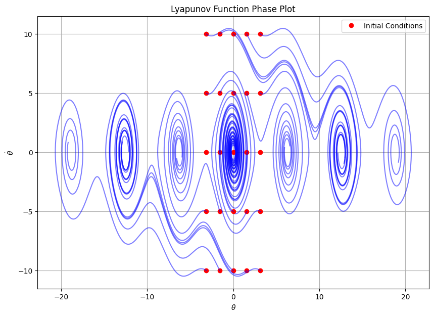

## Lyapunov Direct Method for Stability Analysis

### Scope
Through these notes, you will learn the importance of Lyapunov stability including its definition and application in assessing system stability. Furthermore, we will cover the conditions that these functions must satisfy for a system to be considered Lyapunov stable. An example will be provided to gain an understanding of how Lyapunov stability is applied in practice, illustrated through diagrams and code.

### Motivation
In industrial processes, you have to control many variables such as a position of an object to the temperature of a process. Ideally, you want all process variables to acheive a stability at a desired level. There are many concepts of stability:
* **Lyapunov stable**
* Asymptotically stable
* Exopnentially stable
* BIBO stable
* Internally stable
* etc.


Lyapunov is a powerful tool for assessing the stability of equilibrium points without solving the system's differential equations directly. It's widely used in control systems, robotics, and anywhere system stability is critical.

### Definitions and Notation
__Lyapunov Stability__ - an equilibrium point is stable if all system trajectories starting at nearby points stay nearby

Lyapunov functions must satisfy the following statements and conditions to be Lyapunov stable:

**Lyapunov Functions (no control input)** \
&nbsp;&nbsp; Given a system $\dot{x} = f(x)$ and some region $D \subset R^n$ with $0 \in D$, then if there exists a continuous-differentiable function $V(x)$ such that:
* $V(0) = 0 \rightarrow$ the function at the zero-state is zero
* $V(x) > 0, \forall x \in D \backslash \ 0 \rightarrow$ the function must be greater than zero for all x in the domain except for the zero state
* $\dot{V}(x(t)) = \nabla V(x)^T f(x) \leq 0 \rightarrow$ The time derivative of the Lyapunov function V, as a function of x must be less than or equal to zero

Intuitively, the Lyapunov function " $V(x)$ " is similar to the "energy" of the system, this is nontrivial to find for arbitrary nonlinear systems

### Example: Damped Pendulum
Equation of motion of the damped simple pendulum:

$$ \ddot{\theta} = -\frac {g}{l} \sin{\theta} - k \dot{\theta} $$

State vector:

$$ x = 
\begin{bmatrix}
\theta \\
\dot{\theta}
\end{bmatrix}
$$

Lyapunov Function (total system energy, kinetic + potential):

$$ V(x) = mgl(1 - \cos{\theta}) + \frac{1}{2} m l^2 \dot{\theta^2} $$

Determine if $V(x)$ is a valid Lyapunov function from the conditions above:

&nbsp;&nbsp; **1. $V(0) = 0$** \
&nbsp;&nbsp; Set the state vector $x$ to 0:

$$ x = 
\begin{bmatrix}
\theta \\
\dot{\theta}
\end{bmatrix} =
\begin{bmatrix}
0 \\
0
\end{bmatrix}
$$

&nbsp;&nbsp; Plug into Lyapunov function $V(x)$:

$$ V (0) = mgl(1 - \cos{0} ) + \frac{1}{2} m l^2 0^2 $$

$$ V (0) = 0 $$

&nbsp;&nbsp; The first condition is **satisfied**

&nbsp;&nbsp; **2. $V(x) > 0, \forall x \in D \backslash 0$**

&nbsp;&nbsp; $V(x) = mgl(1 - \cos{\theta}) + \frac{1}{2} m l^2 \dot{\theta^2}$

* Cosine term is always $\leq 1$, thus $(1 - \cos{\theta}) \geq 0$
* Mass of pendulum, $m$, is postitive
* Acceleration due to gravity, $g$, is positive
* Length of pendulum, $l$, is postitive
* Anglular velocity, $\dot{\theta}$, is squared which will be positive

&nbsp;&nbsp; The second condition is **satisfied**

&nbsp;&nbsp; **3. $\dot{V}(x(t)) \leq 0$**

$$ V(x) = mgl(1 - \cos{\theta}) + \frac{1}{2} m l^2 \dot{\theta^2} $$

&nbsp;&nbsp; Take the derivative:

$$ \dot{V}(x) = mgl \dot{\theta} \sin{\theta} + m l^2 \dot{\theta} \ddot{\theta} $$

&nbsp;&nbsp; Plug in $\ddot{\theta}$:

$$ \dot{V}(x) = mgl \dot{\theta} \sin{\theta} + m l^2 \dot{\theta} (-\frac {g}{l} \sin{\theta} - k \dot{\theta}) $$

$$ \dot{V}(x) = mgl \dot{\theta} \sin{\theta} - mgl \dot{\theta} \sin{\theta} - mkl^2 \dot{\theta^2} $$

$$ \dot{V}(x) = - mkl^2 \dot{\theta^2} $$

* Mass of pendulum, $m$, is postitive
* Damping term, $k$, is positive
* Length of pendulum, $l$, is postitive
* Anglular velocity, $\dot{\theta}$, is squared which will be positive
* Thus the overall derivative will be negative

&nbsp;&nbsp; The third condition is **satisfied**

### Code
The Python script below will output a phase plot of the above example demonstrating Lyapunov stability

```python
import numpy as np
import matplotlib.pyplot as plt

# Constants
m = 1.0  # mass (kg)
g = 9.81  # gravity (m/s^2)
l = 1.0  # length (m)
k = 0.5  # damping coefficient

# Lyapunov function
def V(theta, theta_dot):
    return m*g*l*(1 - np.cos(theta)) + 0.5*m*(l**2)*(theta_dot**2)

# Equation of motion for the damped pendulum
def damped_pendulum(theta, theta_dot):
    return -g/l * np.sin(theta) - k * theta_dot

# Grid for theta and theta_dot
theta = np.linspace(-np.pi, np.pi, 400)
theta_dot = np.linspace(-10, 10, 400)
Theta, Theta_dot = np.meshgrid(theta, theta_dot)

# Figure setup
plt.figure(figsize=(10, 7))

first_pt = True  # variable to determine if the first point has been labeled to reduce the legend size

# Simulate and plot trajectories with pendulum starting between -pi and pi radians
for theta0 in np.linspace(-np.pi, np.pi, 5):
    # Start pendulum between -10 and 10 rad/s and plot 
    for theta_dot0 in np.linspace(-10, 10, 5):
        if first_pt:
            plt.plot(theta0, theta_dot0, 'ro', label='Initial Conditions')  # mark the initial theta and theta_dot in red and label it
            first_pt = False
        else:
            plt.plot(theta0, theta_dot0, 'ro')  # mark the initial theta and theta_dot in red
        theta_hist = [theta0] # initialize list of theta history
        theta_dot_hist = [theta_dot0] # initialize list of theta_dot history
        dt = 0.01
        for _ in range(1000):
            theta, theta_dot = theta_hist[-1], theta_dot_hist[-1]  # get last entry values for theta and theta_dot in the history list
            theta_dot_next = theta_dot + damped_pendulum(theta, theta_dot) * dt  # calculate the next theta_dot value from the previous + dt
            theta_next = theta + theta_dot * dt  # calculate the next theta value from the previous + dt
            # Add theta_next and theta_dot_next to history
            theta_hist.append(theta_next)
            theta_dot_hist.append(theta_dot_next)
        plt.plot(theta_hist, theta_dot_hist, color="blue", alpha=0.5)

plt.xlabel(r'$\theta$')
plt.ylabel(r'$\dot{\theta}$')
plt.title('Lyapunov Function Phase Plot')
plt.legend()
plt.grid(True)
plt.show()
```



The above chart demonstrates the phase plot of of a simple damped pendulum starting at different $\theta$ and $\dot{\theta}$ initial conditions. From this chart, you can observe that when the pendulum starts at small angles and low angular velocities, it will rest at its final state, 0 radians (straight down). When given a larger initial angular position and velocity, the pendulum swings over its vertical center of $\pm \pi$ radians. The pendulum always spiraling inwards towards equilibruim at $\pm 2\pi k$ radians (where k is an integer) demonstrates that regardless of the initial conditions within a certain vicinity of these points, the pendulum's motion will converge to one of these stable equilibria. The exception to this is when the pendulum starts at $\pm \pi k$ radians (vertical) with zero initial angular velocity which is an unstable equilibrium. When perturbed, it will converge to the stable equilibrium. This convergence is a key characteristic of Lyapunov stability, showing that small deviations from the equilibrium state result in motions that eventually decay back to equilibrium.

### Conclusion
Lyapunov stability is a fundamental concept in the theory of dynamical systems, providing a framework for understanding the behavior of systems in response to small perturbations. It focuses on the behavior of systems near their equilibrium points and offers methods to analyze stability without explicitly solving differential equations. Through these notes, we worked through a damped pendulum example which shows trajectories spiraling towards stable equilibrium points illustrating Lyapunbov stability and the reduction of total energy overtime. Other examples that can be analyzed using this method include spring-mass-damper and electrical circuit systems. By focusing on the system's behavior in the vicinity of equilibrium points and using Lyapunov functions to assess energy changes, the theory helps predict whether a system will remain stable, return to a stable state, or diverge when subjected to small disturbances.

### References
[1] [Underactuated Robotics: Algorithms for Walking, Running, Swimming, Flying, and Manipulation](https://underactuated.mit.edu/lyapunov.html) by Russ Tedrake \
[2] [NCS - 15 - Lyapunov stability - Definition and explanation](https://www.youtube.com/watch?app=desktop&v=7IporYelLU0) \
[3] [Phase Plane Analysis and Stability](https://www.cds.caltech.edu/~murray/courses/cds101/fa02/precourse/leok-26sep02.pdf) by Melvin Leok \
[4] [Introduction to Dynamical Systems](https://www.epfl.ch/labs/lasa/wp-content/uploads/2022/04/Lect3_DS-Theory.pdf)
