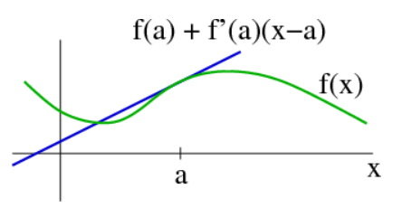

# Linearization

**Scope: Linearization in Multivariable Control System** 
- Many control models in real world are mostly made up of multiple states and a inputs. Using one of familiar examples, pendulum, which is often covered in our course, we will study how linearization can be applied in multivariable control system.

**Objectives**
- To review the definition and the mathematical foundation of linearization.
- To remind how to apply linearization in practical control system problem.
- To look over code snippets(JAX, auto_diff) for linearizing the control system.

## Introduction
Linearization simplifies nonlinear dynamics into linear models, making complex problems easier to analyze, understand and predict in fields like robotics, physics, economics, and ecology. It is key for dealing with real-world challenges, bridging theory with practice, and enhancing system stability and responsiveness, integrating well with various control strategies.


## Preliminaries
- **Nonlinear vs Linear control system**:
  |          category             |           Nolinear          |         Linear               |
  |----------------------------   | ----------------------------| -----------------------------|
  |       Characteristics         |   Complex, Curved graph     |  Simple, straight line graph |
  |   In continous-time system    |      <i>ẋ = f(x, u)</i>     |      <i>ẋ = Ax + Bu</i>      |
  |   In discrete-time system     |     <i>x<sub>k+1</sub> = f(x<sub>k</sub>, u<sub>k</sub>)</i> | <i>x<sub>k+1</sub> = Ax<sub>k</sub> + Bu<sub>k</sub></i> |
  | Equilibrium point | Many points | Only one point |
- **Linearization(or linear approximation)** explains local behavior of a nonlinear system by a linear system. We can linearize a sytem by using 'Taylor series expansion'. The linear approximation of a function is the first order Taylor expansion around the point of interest.

- **Talor series expansion**
  - Pick a point 'a
  
  - For 1-Dimension: $f(x) = f(a) + f'(a)(x-a) \textcolor{red}{\left( + \frac{1}{2!} f''(a)(x-a)^2 + \cdots + \frac{1}{n!} f^{(n)}(a)(x-a)^n + \cdots \right)}$
    
    Here, the red part is Higher order Term $\textcolor{red}{(H.O.T.) ≈ 0}$
  - For N-Dimension: $f(\vec{x}) = f(\vec{a}) + \nabla f(a)^{T} (\vec{x} - \vec{a})$

The transpose of the gradient of \(f(x)\) can be represented as:

$$
\nabla f(x)^T = \left[ \begin{array}{cccc}
\frac{\partial f_1}{\partial x_1} & \frac{\partial f_1}{\partial x_2} & \cdots & \frac{\partial f_1}{\partial x_n} \\
\frac{\partial f_2}{\partial x_1} & \frac{\partial f_2}{\partial x_2} & \cdots & \frac{\partial f_2}{\partial x_n} \\
\vdots & \vdots & \ddots & \vdots \\
\frac{\partial f_n}{\partial x_1} & \frac{\partial f_n}{\partial x_2} & \cdots & \frac{\partial f_n}{\partial x_n}
\end{array} \right]
= \left[ \begin{array}{c}
\nabla f_1(x)^T \\
\nabla f_2(x)^T \\
\vdots \\
\nabla f_n(x)^T
\end{array} \right]
, \ where \ f(x) = \left[ \begin{array}{c}
f_1(x)\\
f_2(x)\\
\vdots \\
f_n(x)
\end{array} \right]
$$

The extended state vector $\tilde{x}\$ is defined as:

$$
\tilde{x} = \left[ \begin{array}{c}
x\\
u\\
\end{array} \right]
$$

The function $f(x, u)$ and its linear approximation around the operating point $\(x_0, u_0)\$ are given by:

$$
f(x,u) = f(x_0,u_0) + \nabla_x f(x_0,u_0)^T (x - x_0) + \nabla_u f(x_0,u_0)^T (u - u_0), \ where \ (x_0, u_0) \ is \ constant.
$$

The simplified linear model can be expressed as:

$$
f(x,u) = \textcolor{green}{\nabla_x f(x_0,u_0)^T} x + \textcolor{blue}{\nabla_u f(x_0,u_0)^T}u - \textcolor{red}{\nabla_x f(x_0,u_0)^T x_0 - \nabla_u f(x_0,u_0)^T u_0 + f(x_0,u_0)}
$$

$$
f(x,u) = \textcolor{green}{A} x + \textcolor{blue}{B}u - \textcolor{red}{C}    \quad \text{($C$ is constant)}
$$

## Main Body

### Let's apply Linearization to Unicycle model
- **Numerical Linearization(figure, diagrams or gif)**
  - Given the unicycle model dynamics:
$$\dot{x} = v \cos(\theta)$$
$$\dot{y} = v \sin(\theta)$$
$$\dot{\theta} = \omega$$


The linearized model around the operating point $\((x_0, y_0, \theta_0, v_0, \omega_0)\)$ is given by:

$$
\delta \dot{x} = \delta v \cos(\theta_0) - v_0 \sin(\theta_0) \delta \theta
$$

$$
\delta \dot{y} = \delta v \sin(\theta_0) + v_0 \cos(\theta_0) \delta \theta
$$

$$
\delta \dot{\theta} = \delta \omega
$$

### Snippet codes for Linearization (code)

- **Using JAX:** Simplifies derivative calculation for linearization.

```python
import jax.numpy as jnp
from jax import grad

def f(x): return x**2
df = grad(f)
print(df(2.0))  # Outputs 4.0
```
## Conclusion(50-70)
Linearization, discretization, and automatic differentiation form a powerful trio for control systems design and analysis. This note covers the basics, setting a foundation for further exploration into control strategies and nonlinear dynamics.

## Reference
