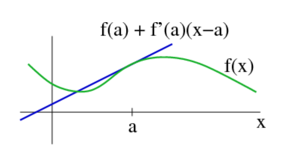

# Linearization

**Scope: Linearization in Multivariable Control System** 
- Many control models in real world are mostly made up of multiple states and a inputs. Using simple examples, pendulum, which is often covered in classes, we will study how linearization can be applied in multivariable control system.

**Objectives**
- To review the definition and the mathematical foundation of linearization.
- To remind how to apply linearization using the pendulum example.
- To look over code snippets such as JAX for linearizing the control system.

## Introduction
Linearization simplifies nonlinear dynamics into linear models, making complex problems easier to analyze, understand and predict in fields like robotics, physics, economics, and ecology. It is key for dealing with real-world challenges, bridging theory with practice, and enhancing system stability and responsiveness, integrating well with various control strategies.


## Preliminaries
- **Nonlinear vs Linear control system**:
  |          category             |           Nolinear          |         Linear               |
  |----------------------------   | ----------------------------| -----------------------------|
  |       Characteristics         |   Complex, Curved graph     |  Simple, straight line graph |
  |   In continous-time system    |      <i>ẋ = f(x, u)</i>     |      <i>ẋ = Ax + Bu</i>      |
  |   In discrete-time system     |     <i>x<sub>k+1</sub> = f(x<sub>k</sub>, u<sub>k</sub>)</i> | <i>x<sub>k+1</sub> = Ax<sub>k</sub> + Bu<sub>k</sub></i> |
  | Equilibrium point | Many points | Only one point |
- **Linearization(or linear approximation)** explains local behavior of a nonlinear system by a linear system. We can linearize a sytem by using 'Taylor series expansion'. The linear approximation of a function is the first order Taylor expansion around the point of interest.

 

- **Talor series expansion**
  - Pick a point 'a
  - For 1-Dimension: $f(x) = f(a) + f'(a)(x-a) \textcolor{red}{\left( + \frac{1}{2!} f''(a)(x-a)^2 + \cdots + \frac{1}{n!} f^{(n)}(a)(x-a)^n + \cdots \right)}$
    
    Here, the red part is Higher order Term $\textcolor{red}{(H.O.T.) ≈ 0}$
  - For N-Dimension: $f(\vec{x}) = f(\vec{a}) + \nabla f(a)^{T} (\vec{x} - \vec{a})$

The transpose of the gradient of \(f(x)\) can be represented as:

$$
\nabla f(x)^T = \left[ \begin{array}{cccc}
\frac{\partial f_1}{\partial x_1} & \frac{\partial f_1}{\partial x_2} & \cdots & \frac{\partial f_1}{\partial x_n} \\
\frac{\partial f_2}{\partial x_1} & \frac{\partial f_2}{\partial x_2} & \cdots & \frac{\partial f_2}{\partial x_n} \\
\vdots & \vdots & \ddots & \vdots \\
\frac{\partial f_n}{\partial x_1} & \frac{\partial f_n}{\partial x_2} & \cdots & \frac{\partial f_n}{\partial x_n}
\end{array} \right]
= \left[ \begin{array}{c}
\nabla f_1(x)^T \\
\nabla f_2(x)^T \\
\vdots \\
\nabla f_n(x)^T
\end{array} \right]
, \ where \ f(x) = \left[ \begin{array}{c}
f_1(x)\\
f_2(x)\\
\vdots \\
f_n(x)
\end{array} \right]
$$

The extended state vector $\tilde{x}\$ is defined as:

$$
\tilde{x} = \left[ \begin{array}{c}
x\\
u\\
\end{array} \right]
$$

The function $f(x, u)$ and its linear approximation around the operating point $\(x_0, u_0)\$ are given by:

$$
f(x,u) = f(x_0,u_0) + \nabla_x f(x_0,u_0)^T (x - x_0) + \nabla_u f(x_0,u_0)^T (u - u_0), \ where \ (x_0, u_0) \ is \ constant.
$$

The simplified linear model can be expressed as:

$$
f(x,u) = \textcolor{green}{\nabla_x f(x_0,u_0)^T} x + \textcolor{blue}{\nabla_u f(x_0,u_0)^T}u - \textcolor{red}{\nabla_x f(x_0,u_0)^T x_0 - \nabla_u f(x_0,u_0)^T u_0 + f(x_0,u_0)}
$$

$$
f(x,u) = \textcolor{green}{A} x + \textcolor{blue}{B}u + \textcolor{red}{C}    \quad \text{($C$ is constant)}
$$

## Main Body

### Let's apply Linearization to Pendulum example!


- First, we will solve Pendulum problem in **mathematical way**, which we studied in Preliminary section.

The given pendulum equation is:

$$
\dot{x} = \left[ \begin{array}{c}
\dot{x}_1 \\
\dot{x}_2
\end{array} \right]
 = \left[ \begin{array}{c}
x_2 \\
 \-\omega^2 \sin(x_1) - r x_2
\end{array} \right]
$$

Here, the control input u is autonomous force, so we will consider u = [0, 0]ᵀ

The equilibrium points $f(x) = 0$ lead to 

$$
\bar{x} = x_0 = \left[ \begin{array}{c}
0 \\
0 
\end{array} \right]
$$

Let's linearize around the equilibrium points. The linearization around an equilibrium point $x_0$ can be expressed using the Taylor series as follows:

$$
f(x) ≈ ∇_x f(x_0)^T (x - x_0) + f(x_0)
$$

For the pendulum system, the Jacobian $∇_x f(x_0)^T$ around the equilibrium point $x_0 = [0, 0]^T$ is:

$$
∇_x f(x_0) = \left[ \begin{array}{cc}
\frac{\partial \dot{x}_1}{\partial x_1} & \frac{\partial \dot{x}_1}{\partial x_2} \\
\frac{\partial \dot{x}_2}{\partial x_1} & \frac{\partial \dot{x}_2}{\partial x_2}
\end{array} \right]
 = \left[ \begin{array}{cc}
0 & 1 \\
-\omega^2 \cos(x_1) & -r
\end{array} \right]
 = \left[ \begin{array}{cc}
0 & 1 \\
-\omega^2 & -r
\end{array} \right]
$$

Thus, the linear approximation of $f(x)$ near $x_0 = [0, 0]^T$ would be:

$$
f(x) ≈ ∇_x f(x_0)^Tx - ∇_x f(x_0)^T x_0 + f(x_0)
$$

$$
f(x) ≈ \textcolor{green}{\left[ \begin{array}{cc}
0 & 1 \\
-\omega^2 & -r
\end{array} \right]} * 
\left[ \begin{array}{c}
x_1 \\
x_2
\end{array} \right] - 
\textcolor{red}{\left[ \begin{array}{cc}
0 & 1 \\
-\omega^2 & -r
\end{array} \right] *
\left[ \begin{array}{c}
0\\
0
\end{array} \right] +
\left[ \begin{array}{c}
0\\
0
\end{array} \right]}
$$

$$
f(x) ≈ \textcolor{green}{A} x + \textcolor{red}{C}
$$

- Now, we will use **codes** for the Pendulum example especially **JAX**
  
**JAX:** can automatically compute gradients of functions using forward-mode differentiation **('jax.jacfwd)** and reverse-mode differentiation **(jax.grad)**
The code is as follows:
```python
# JAX
import jax.numpy as jnp
from jax import grad, jacfwd

def pendulum_dynamics(x, omega=1.0, r=0.1):
    x1, x2 = x
    dx1dt = x2
    dx2dt = -omega**2 * jnp.sin(x1) - r * x2
    return jnp.array([dx1dt, dx2dt])

def linearize_system(x, omega=1.0, r=0.1): 
    jacobian_func = jacfwd(pendulum_dynamics, argnums=0)
    jacobian_at_x = jacobian_func(x, omega, r)   
    return jacobian_at_x

x_example = jnp.array([0.0, 0.0])  # Equilibrium point
omega = 1.0  # Natural frequency
r = 0.1      # Damping coefficient
jacobian_at_equilibrium = linearize_system(x_example, omega, r)
print("Jacobian matrix at the equilibrium point:", jacobian_at_equilibrium)
```
- Other **Snippet codes** you can use for **linearization**:
```  
# TensorFlow
import tensorflow as tf
@tf.function
def pendulum_tf(x):
    x1, x2 = x[0], x[1]
    return tf.stack([x2, -omega**2 * tf.sin(x1) - r * x2])
x_tf = tf.Variable([0.0, 0.0])
with tf.GradientTape() as tape:
    tape.watch(x_tf)
    y_tf = pendulum_tf(x_tf)
A_tf = tape.jacobian(y_tf, x_tf)

# PyTorch
import torch
def pendulum_torch(x):
    x1, x2 = x.unbind()
    return torch.stack([x2, -omega**2 * torch.sin(x1) - r * x2])
x_torch = torch.tensor([0.0, 0.0], requires_grad=True)
y_torch = pendulum_torch(x_torch)
A_torch = torch.autograd.functional.jacobian(pendulum_torch, x_torch)

# Auto_diff (Pseudocode)
def pendulum_auto_diff(x, omega=1.0, r=0.1):
    x1, x2 = x
    return [x2, -omega**2 * auto_diff.sin(x1) - r*x2]
x0_auto_diff = [0.0, 0.0]
A_auto_diff = auto_diff.compute_jacobian(pendulum_auto_diff, x0_auto_diff)
```
**TensorFlow** excels in scalable deep learning, offering (tf.GradientTape) for eager automatic differentiation and optimizations via (tf.function). It uniquely integrates with tools like TensorBoard for visualization and TensorFlow Lite for mobile, standing out for deployment capabilities.

**PyTorch** is useful for research with its dynamic computation graphs and intuitive, Pythonic syntax. It's particularly user-friendly for rapid prototyping and iteration, differentiating itself with a more accessible approach to graph construction and debugging.

**Auto_diff (Pseudocode)** conceptualizes automatic differentiation, simplifying the understanding of gradient and Jacobian computation without tying to a specific API(Application Programming Interface), highlighting the core principles of auto differentiation technologies.

## Conclusion
Linearization simplifies complex systems into easier linear models, crucial for better understanding and control in many areas. This guide shows how to use linearization on a pendulum, with clear math explanations and code examples in JAX, TensorFlow, and PyTorch, showcasing how these tools make analyzing systems straightforward.

## Reference
[1] Nonliear Linear System(Third Edition) by Hassan K. Khalil.

[2] [Underactuated Robotics: Algorithms for Walking, Running, Swimming, Flying, and Manipulation](https://underactuated.csail.mit.edu/) by Russ Tedrake 

[3] Optimal Control Theory: An Introduction by Donald E. Kirk.

[4] [Linear Systems Theory](https://web.ece.ucsb.edu/~hespanha/linearsystems/) by Joao Hespanha

[4] *JAX 101: JAX Basics*. JAX Documentation. Available at: [https://jax.readthedocs.io/en/latest/jax-101/01-jax-basics.html](https://jax.readthedocs.io/en/latest/jax-101/01-jax-basics.html). Last accessed: 2024-04-03.
