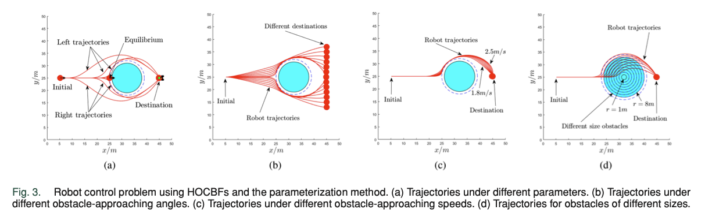

# Foundations of Control Barrier Functions 

## Introduction 
In recent years we have had a widespread deployment of autonomous systems, from autonomous vehicles to surgical robots, these systems rely on their ability to perform complex tasks while providing safety assurances. There is an increasing number of complex applications with inherent real-world uncertainties using these systems requiring autonomous systems to perform tasks in a safety-critical scenario, meaning a mistake could be fatal. Control barrier functions (CBFs) have recently become a popular technique for **guarenteeing safety** of autonomous systems by ensuring a system remain in a safe set for the duration of its time horizon. In this note, we will discuss the theory behind CBFs and how to design safe controllers. 

## Preliminaries

### Theoretical Motivation
Control Barrier Functions (CBFs) are motivated from the perspective of control Lyapunov functions (CLFs) which provide guarentees for the stabilization of (nonlinear) dynamical systems. This leads to the "dual" of stability which is safety of a dynamical systems via set invariance and further CBFs in the form of safety sets and enforcing safety through optimization-based controllers. This note will contain a discussion of the theoretical foundations to understand CBFs but will skip a review of Lyapounov Stabiltiy and CLFs (check [2], [3] for more information). 

### Forward Invariance
To first understand the theory behind control barrier functions (CBFs) we must first learn about control invariant sets. The first investigation into safety for dynamical systems was by Nagumo when he provded neccessary and sufficient conditions for set invariance [1]. Lets define what it means to have a positivley invariant set (also called a forward invariant set). We consider a continuous dynamical system: 

$$
 \dot{x}(t) = f(x,t), \hspace{0.2cm} t \geq 0
$$
 
where $x(t) \in \mathbb R^n$ are the state variables, $t$ is the time variable, and $f$ is a continous function. We now provide the definition of the forward invariant set of a dynamical system. 

**Definition (Forward Invariance)** Assume $\mathcal C$ is a set in $\mathbb R^n$. The set $\mathcal C$ is called a forward invariant set of the aforementioned dynamical system if $x(0) \in \mathcal C$ implies $x(t) \in \mathcal C$ for all $t \geq 0.$ 

In other words, a forward invariant set is a set that once a trajectory of a dynamical system enters the set it will never leave the set for all time. 

## Control Barrier Functions
We first consider the control affine system: 

$$
\dot{x} = f(x) + g(x) u 
$$

with $f$ and $g$ locally Lipschitz, $x \in D \subset \mathbb R^n$ and $u \in U \subset \mathbb R^m$ is the set of admissible control inputs. 

Previously we defined the forward invariance of a set, now we will formalize the function that gives guarentees for the trajectory of our dynamical system to remain safe for the entirity of its time horizon. If you recall, Lyapunov stability drives a system to a point (or a set) in a fashion similar to an energy function, there is a dissapation of the trajectory to that point. Safety, rather, can be framed in the context of enforcing invariance of a set, i.e., not leaving a **safe set** once it has been entered. Particularily, we define a set $\mathcal C$ as the *superlevel set* of a continuously differentiable function $h : D \subset \mathbb R^n \rightarrow \mathbb R$ giving the following, 

$$
\begin{aligned}
\mathcal C = \{ x \in D \subset \mathbb R^n : h(x) \geq 0 \}, \\
\partial \mathcal C = \{x \in D \subset \mathbb R^n : h(x) = 0 \} \\
\text{Int}(\mathcal C) = \{x \in D \subset \mathbb R^n : h(x) > 0 \}. \\
\end{aligned}
$$

We call $\mathcal C$ the **safe set**. 

Although motiviated by and a generalization of CLFs, CBFs are different in that fact that we wish to enforce set invariance without strictly requiring a positive definite function $V(x)$. The continuoulsy differentiable function we define with regards to CBFs, $h(x)$, renders our safe set $\mathcal C$ invariant but not its sublevel sets. This allows a trajectory inside the invariant set to envolve anywhere inside the set rather than dissipating to a certain point in the set (it can even move up to and along the boundary of the invariant set, $\partial \mathcal C$). 

We first define the extended class $K_{\infty}$ function as $\alpha : \mathbb R \rightarrow \mathbb R$ that is strictly increasing and zero at zero, i.e., $\alpha (0) = 0$, so the *extended* function is defined on the entire real line: $\mathbb R = (-\infty, \infty)$. With this, we can now define control barrier functions as in [4], [5]: 

**Definition (Controll Barrier Functions)** Let $\mathcal C \in D \in \mathbb R^n$ be the superlevel set of a continuously differentiable function $h : D \rightarrow \mathbb R$, then $h$ is a *control barrier function (CBF) if there exists an extended class $K_{\infty}$ function $\alpha$ such that for the control affine system: 

$$
\text{sup}_{u\in U} [L_f h(x) + L_g h(x) u] \geq - \alpha (h(x)) \hspace{0.2cm}
$$

for all $x \in D$ and where $L_f = \nabla h(x)^T f(x)$ and $L_g = \nabla h(x)^T g(x)$.

So therefore to **guarentee safety via CBFs** we consider the set consisting of all the control inputs that render the set $\mathcal C$ safe: 

$$
K_{cbf} (x) = \{u \in U : L_f h(x) + L_g h(x) u + \alpha (h(x)) \geq 0 \}.
$$

Therefore, we can clearly define the set of all control inputs at some $x \in D$ that keep the system safe. It follows that the existence of a control barrier function implies that the control system is safe. It's noted in [4] that CBFs do indeed provide the strongest possible conditions for safety since they are neccessary and sufficient given the assumptions we have on $\mathcal C$. 

## Optimization-based Control with CBFs 
Given that we have covered the theoretical definitions of control barrier functions and the fact that they provide the conditions to guarentee safety of our system, we can now explore how to incorporate CBFs into an optimization-based controller. This is called synthesizing controllers for **safety-critical control**. 

Suppose we are given a nominal feedback controller $\pi(x)$ for the control affine system. This controller may not satisfy the CBF conditions for safety and thus generates control inputs $u$ that aren't in our safe set, i.e., $u \notin K$. We wish to devise a controller that modifies the nominal feedback controller in a minimally invasive fashion (as to still reach some goal state) in order to produce safe controls. Thus, we  consider a quadratic program (QP) formulation that finds a minimal perturbation on $u$:

$$
\begin{aligned}
u(x) = \text{argmin}_{u \in U} \hspace{0.3cm} \frac{1}{2} || u - \pi(x) ||_2^2 \\
\\
\hspace{0.5cm} \text{s.t.} \hspace{0.3cm} L_f h(x) + L_g h(x) u \geq \alpha (h(x)) 
\end{aligned}
$$

This gives straightforward method to devleop a controller to guarentee a system be safe. Since the objective is a min-norm and the constraint is linear in $u$, this program is a convex quadratic program that can be solved efficiently online. In practice, this QP-based controller serves as a safety filter on the nominal controller to ensure safe control inputs into the dynamics, rendering the system safe.

## Example 
Below is an image of a high-order CBF, but it shows the basics of having an initial trajecotry from a nominal policy approaching an obstacle and the CBF controller modifying the control inputs to steer around the obsctacle. 

*Image from HOCBF paper: https://ieeexplore.ieee.org/stamp/stamp.jsp?tp=&arnumber=9516971*

Additionally here is a video example from Caltech of them implementing a CBF on a segway that shows its capabilities: https://www.youtube.com/watch?v=RYXcGTo8Chg 

## Current Research 
Control barrier funcitons (CBFs) is actually a recent and vibrant research field in safety-critical control of autonomous systems. The seminal paper by Dr. Aaron Ames from Caltech was published in only 2017! Since then there has been an explosion of new developments in the field. There is a need for a remark on the difficulties of CBFs. 

**Devising a CBF is extremely hard**. Finding the barrier function, $h(x)$ is not easy. Handcrafting one is obviously difficult and most likely will lead to either an over-approximation which is too conservative, or an under-approximation rendering our system unsafe. In other cases, we have high-relative degree system, e.g., the simplest example being a doubel integrator system. Generating a valid CBF for a high-relative degree system is difficult although there are some methods in [7] and other papers that have methods to handle this. Another difficulty is handling input-constrained systems such as actuation limits. In those circumstances, we may not have a feasible set to pick a safe control input. 

Due to these difficulties, data-driven and learning-based methods (such as NN approximations) have been used to learn valid CBFs such as in [8]. Learning-based CBFs is an active field of research. 

## Conclusion 
In this note we briefly discussed the theoretical foundations of control barrier functions and how to perform controller synthesis with CBF-QPs. We discussed at a high-level why CBFs are useful in modern day autonomy and the difficulties in handcrafting or designing a CBF. We also mentioned that it is an active field of research with many top professors and instituions actively researching how to incorporate CBFs to enable safer autonomous systems and deploy them into real-world scenarios. 

## References
1. F. Blanchini, "Set invariance in control," Automatica, vol. 35, no. 11, pp. 1747-1767, 1999. 

2. Sontag, E. D., "A 'universal' construction of Artstein's theorem on nonliner stabilization," Systems and Control Letters 117-123, 1989. 

3. A. Ames, K. Galloway, K. Sreenath, and J. Grizzle. "Rapidly exponentially stabilizing control Lyapunov functions and hybrid zero dynamics," IEEE Transactions on Automatic Control, 2014. 

4. A. Ames, S. Coogan, M. Egerstedt, G. Notomista, K. Sreenath, P. Tabuada. "Control Barrier Functions: Theory and Applications," 2019. 

5. AD Ames, X XU, JW Grizzle, P Tabuada. "Control barrier function based quadratic programs for safety crtiical systems," IEEE Transactions on Automatic Control, 62 (8), 3861-3876, 2017. 

6. Wikipedia, "Class Kappa Function," https://en.wikipedia.org/wiki/Class_kappa_function. 

7. Wei Xiao, Calin Belta. "High-Order Control Barrier Functions", 2022. 

8. C. Dawson, S. Gao, C. Fan. "Safe contorl with learned certificates: A survey of neural lyapunov, barrier, and contraction methods for robotics and control, 2023. 