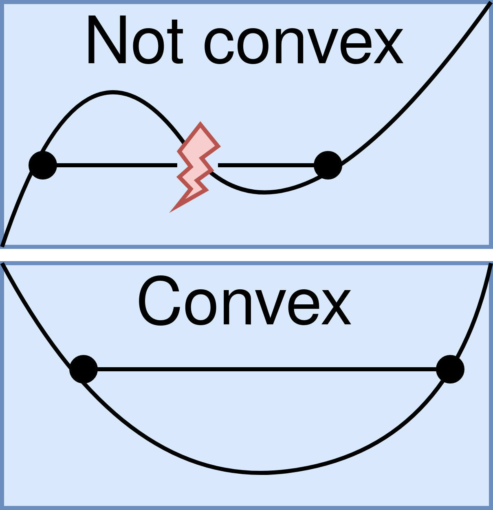
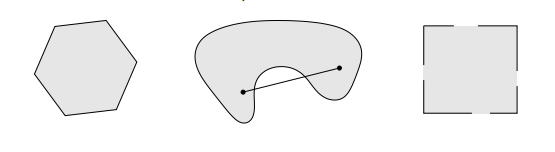
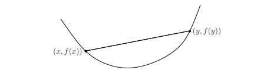

# Intro to Convex Optimization

## Scope and Objective
These notes will serve as a brief introduction to Convex Optimization within the field of Controls. Since this is also my introduction to optimization, it will cover more of the basics of convex optimization and what distinguishes it from other optimization problems.  

## Introduction to optimization
Optimization is a topic that is used in mathematics, computer science, engineering, and economics. It is a method of finding the best or optimal solution to a defined problem or system. Optimization problems can occur on an incredibly broad scale, from optimizing everyday things like coffee consumption based on your relaxed constraints in your everyday life to optimizing aircraft performance based on strict mechanical, aerodynamic, and financial constraints. Almost any system can be made into an optimization problem, and due to advancements in mathematical computing, most convex problems can be solved using a standard method and code base. Often, the difference between an easy-to-solve and a hard-to-solve optimization problem is not linear vs nonlinear but convex vs non-convex. 

In controls, optimization allows us not just to choose a feasible control input for our system, or even just a good control for our system, but to find the best control input based on our constraints, desired behavior, and current state. This can be a powerful tool. However, there are some limiting factors. While the mathematical framework for setting up an optimization problem can be used to define most problems, actually solving a problem can yield very crude solutions. The key to solving an optimization problem simply and convincingly is to frame the problem using a convex objective function and convex set[3]. The rest of these notes will explain how to recognize convex functions and sets as well as formulating and solving optimization problems.   


## Preliminaries  

### Convexity 
Mathematics defines a function as convex if and only if a line segment can be drawn between any two distinct points, and the rest of the function stays below that line.  

<p align="center">
  
</p> 
[4]

The function is usually visually shaped like a bowl or a U or in mathematical terms has positive curvature. 

The significance of convexity in optimization is primarily due to the property of convex functions to have a single global minimum. Since a Convex function is bowl-shaped, everything is sloped to a single lowest point. This means there is only one optimal solution, and all paths lead towards it. You can imagine that for a function with many dips and valleys, it may be challenging to find the global minimum since there are so many local minimums. 

**Convex Set:** If C is a convex set then any line segments drawn between two points in C must also be in C, i.e. any $x_1, x_2 \in C$ and any $\theta$ with $0 \leq \theta \leq 1$ we have  
$$\theta x_1 + (1+\theta)x_2 \in C$$


ex:   
<p align="center">
  
</p>  
[1]
The first shape is a convex set, while the other two are not convex. The third shape cannot be convex because parts of the boundary are not included in the set meaning a line cannot be drawn across it.   

Other types of convex sets:

* Convex Hull  
* Convex Cone  
* Hyperplanes and Halfspaces    
* Euclidian balls and Ellipsoids  
* Norm balls and norm cones  
* Polyhedra  
* Positive semidefinite cone

For more information on the above convex sets, take a look at [1] page 37.

**Convex Functions:**  
* $f: \pmb{R^n} \rightarrow \pmb{R}$ is convex if the domain of $f$ is a convex set and for all $x,y \in f, 0 \leq \theta\leq1$ we have
$$f(\theta x + (1-\theta)y) \leq \theta f(x) + (1-\theta)f(y)$$

  
  
<p align="center">
  
</p>   
[1]  

* $f$ is concave if -f is convex
* $f$ is strictly convex if the domain of $f$ is convex and for $x,y \in$ domain of $f, x \neq, 0 <\theta< 1,$ 

Example of convex functions: 

* affine: ax+b on **R** for any $a,b \in \pmb{R}$
* exponential: $e^{ax}$ for any $a \in \pmb{R}$
* powers: $x^a$ on $\pmb{R_{++}}$ for $\alpha \geq 1,  \alpha \leq 0$
* powers of absolute value: $|x|^p$ on $\pmb{R}$ for $p \geq 1$
* positive part (relu): max {0,x} 

## Main Body 

### Standard form of an optimization problem 
$$
\begin{aligned}
\text{min}_x f_0 (x)
\end{aligned}
$$
   
$$  
\begin{aligned} 
\text{subject to }   f_i (x) \leq 0, i = 1, ...., m  \\
g_i (x) = 0, i = 1, ...., p     
\end{aligned}
$$
             
* $x \in \pmb{R^n}$ is (vector) variable to be chosen (n scaler variables $x_1, ....., x_n$)
* $f_0$ is the **objective function** to be minimized
* $f_1, ..., f_m$ are the **inequality constraint functions**
* $g_1, ..., g_p$ are the **equality constraint functions**  
[1]

### Standard form of convex optimization problem
$$
\begin{aligned}
\text{min}_x f_0 (x)
\end{aligned}
$$
   
$$  
\begin{aligned} 
\text{subject to }   f_i (x) \leq 0, i = 1, ...., m   
\end{aligned}
$$  

$$Ax = b$$  


* $x \in \pmb{R^n}$
* equality constraints are linear
* $f_1, ... f_m$ are **Convex**: for $\theta \in$ [0,1],  
$$f_i(\theta x+ (1- \theta)y) \leq \theta f_i(x) + (1-\theta)f_i(y))$$  
i.e., $f_i$ have nonnegative (upward) curvature
[1]

The main difference that convex optimization introduces is that both the objective function and the feasible set must now be convex. [2] 

A visualization of a convex objective and constraints vs non convex objective and constraints are see below [6]

<p align="center">
  
</p> 

Two types of problems that we may come across in controls are: 

### Linear Programming  

Simply put, if an optimization problem's requirements and objectives are linear relationships, then it is called linear programming.  

Standard form  

* **Linear (or Affine) function to be minimized**
  eg. $$f(x_1, x_2) = c_1x_1 + c_2x_2$$
* **Problem constraints**
  eg. $$a_{11}x_1 + a_{12}x_2 \leq b_1$$
   $$a_{21}x_1 + a_{22}x_2 \leq b_2$$
* **non-negative variable**
  eg. $$x_1 \geq 0$$
  $$x_2 \geq 0$$ [4]

### Quadratic Programming  
For quadratic programming problems, the objective function is a multivariate quadratic subject to linear constraints on its variables. 

Standard form  

* **Quadratic Convex function**
  $$f_0(x) = c^Tx + x^TQx$$
  for some vector $c \in \pmb{R}^n$ and $Q = Q^T \geq 0$
  - Q is positive semidefinite: it is symmetric, and all eigenvalues are not negative. 
  
* **Problem constraints**
  $$a_{1}x  \leq b_1$$
  $$a_{2}x \leq b_2$$

**note:**  
Linear programming is a special case of quadratic programming where Q is zero [5]

### CVXPY setup example  
CVXPY is a Python library that allows you to solve convex optimization problems in a few lines of code below I will show an example of how to set up a simple optimization problem.  
#### Math:  

$$
\begin{aligned}
\text{min}_x \lVert x \rVert _1
\end{aligned}
$$  

   
$$  
\begin{aligned} 
\text{subject to }   Ax = b\\
   \lVert x \rVert _{\infty} \leq 1
\end{aligned}
$$  

* x is the variable
* A, b are given

#### Code:

```
import cxvpy as cp

A, b = ...

x = cp.Variable(n)
obj = cp.norm(x, 1)
constr = [
  A @ x == b,
  cp.norm(x, 'inf') <= 1
]
prob = cp.Problem(cp.Minimize(obj), constr)
prob.solve()
```
Example from [1].  


This example shows the setup for a general optimization problem with cvxpy, however it should be noted that it only solves the optimal control for the current state and would need to be computed in a loop to find a complete optimal trajectory or solution. 


## Conclusion 
Convex Optimization is an important concept in the control field and makes solving optimization problems much cleaner and easier to work with. Understanding how to spot convex functions and sets can guide the next steps in solving an optimization problem or help you define a problem in a way that makes it convex. While options do exist to solve non-convex optimization problems, complexity and uncertainty can be cut out if you manage to convexify them. 


[1] Convex Optimization, Stephen Boyd, Lieven Vandenberghe https://web.stanford.edu/~boyd/cvxbook/bv_cvxbook.pdf   
[2] https://en.wikipedia.org/wiki/Convex_optimization  
[3] By Varagk - Own work, CC BY-SA 4.0, https://commons.wikimedia.org/w/index.php?curid=124668501  
[4] https://en.wikipedia.org/wiki/Linear_programming  
[5] https://inst.eecs.berkeley.edu/~ee127/sp21/livebook/l_lqp_standard.html  
[6] https://mathworks.com/discovery/convex-optimization.html
