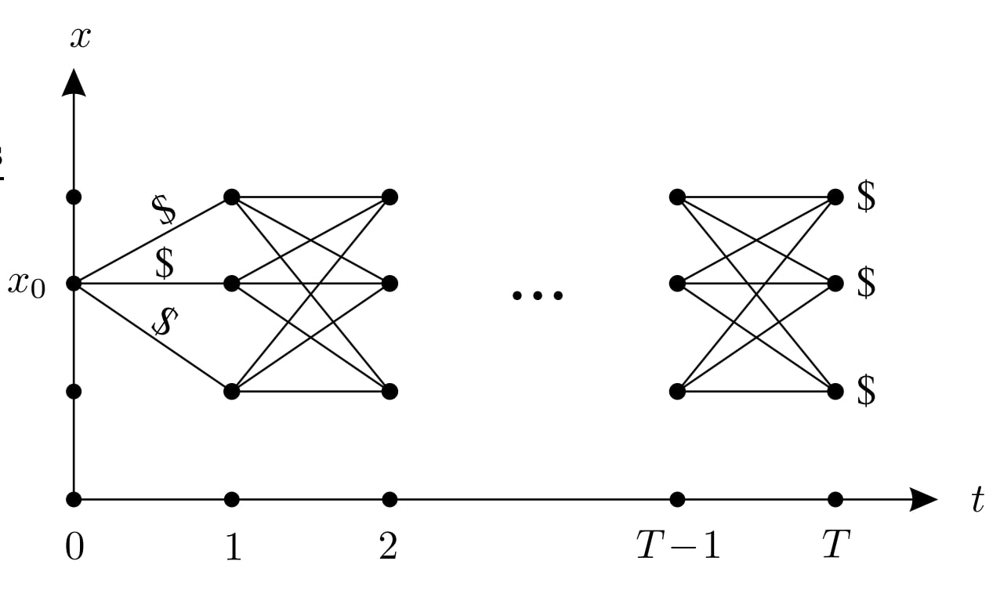

# Introduction to Optimal Control Theory

## Scope

We have seen the use of myopic controllers like PID or operational space control, as well as some predictive controllers like trajectory generation. Predictive control allows the controller to make better decisions at the current time to account for future possibilities, particularly for complex and non-linear systems, but they can be very restrictive to one class of systems. Optimal Control addresses these shortcomings in a highly general framework.                  

## Objectives

Optimal Control addresses these shortcomings by optimizing control inputs over time to achieve desired system behavior while considering constraints and minimizing costs. Unlike myopic controllers such as PID, which react to current error signals without considering future implications, optimal control methods anticipate future system states and adjust control inputs to optimize performance. Similarly, while predictive controllers like trajectory generation can improve performance by planning ahead, they may be restricted to one class of systems. Optimal control theory offers a comprehensive approach that can accommodate a wide range of system dynamics and constraints, making it a powerful tool for designing control strategies in diverse applications.

In these notes, we aim to provide a brief introduction to optimal control, how to specify optimal control problems, and the different types of optimal control techniques explaining its relevance to control theory and outlining its basic principles. By the end, readers should understand the fundamental concepts and motivations behind optimal control.

## Introduction

Optimal control is a cornerstone of control theory, focusing on finding control inputs that optimize a certain criterion, such as minimizing costs or maximizing performance. It finds applications in various fields, including engineering, economics, and biology.

The objective of optimal control theory is _to determine the control signals that will cause a process to satisfy the physical constraints and at the same time minimize (or maximize) some performance criterion._
From an engineering point of view, optimality provides a very useful design principle, and the cost to be minimized (or the profit to be maximized) is often naturally contained in the problem itself.
For example, a driver of a car would like to reach a desired location while achieving several other goals: e.g., avoiding obstacles, not driving erratically, and maintaining a comfortable level of acceleration for human passengers. Optimal control allows a control designer to specify the dynamic model and the desired outcomes, and the algorithm will compute an optimized control. 

Some examples of optimal control problems arising in applications include the following:
* Send a rocket to the moon with minimal fuel consumption;
* Produce a given amount of chemical in minimal time and/or with a minimal amount of catalyst used (or maximize the amount produced in a given time);
* Bring sales of a new product to a desired level while minimizing the amount of money spent on the advertising campaign;
* Maximize throughput or accuracy of information transmission over a communication channel with a given bandwidth/capacity.

## Preliminaries

### Definitions

#### Control System: 

It generates possible behaviors. We will consider the control system to be described by ordinary differential equations (ODEs) that describe its dynamics, which take the form

$$
\dot x = f(t,x,u),\quad x(t_0)=x_0
$$

where $x$ is the _state_ taking values in $\mathbb{R}^n$, $u$ is the _control input_ taking values in some control set $U \subset \mathbb{R}^m$, $t$ is _time_ , $t_0$ is the _initial time_ , and $x_0$ is the _initial state_, and both $x$ and $u$ are functions of time.

#### Cost functional: 

It associates a cost with each possible behavior. For a given initial data $(t_0, x_0)$, the behaviors are parametrized by control functions $u$. So, the cost function assigns a cost value to each admissible control. We will denote cost functionals by $J$, which take the form,

$$ 
J(u) := \int_{t_0}^{t_f} L(x(t),u(t),t)dt + K(t_f,x_f)
$$

where $L$ and $K$ are given functions (_running cost(or Instantaneous cost)_ and _terminal cost_, respectively), $t_f$ is the _final(or terminal) time_, which is either free or fixed, and $x_f:= x(t_f)$ is the _final (or terminal) state_ which is either free or fixed or belongs to some given target set.

Since $u$ is a function of time, therefore J is called a _functional_ because it is a function mapping a function to a real number. 

A variety of behaviors can be specified in this framework by modifying the instantaneous cost. For example:

1. **Trajectory tracking** for a trajectory $x_D(t)$ can be implemented by penalizing squared error:
$$L(x, u, t) = {|x - x_D(t)|}^2$$

3. **Minimizing effort** can be defined in terms of a control penalty:
$$L(x, u, t) = \| u \|^2$$

5. **Minimum time to hit a target** $x_{\text{tgt}}$ could be implemented as an indicator function:
$$I[x \neq x_{\text{tgt}}]$$

   where $I[z]$ is 1 if $z$ is true, and 0 otherwise.

7. **Obstacle avoidance** and other feasibility constraints can be implemented as indicator functions as well:
$$\infty \cdot I[x \notin \mathcal{F}]$$

   where $\mathcal{F}$ is the free space.

9. **Smoothed obstacle avoidance** can be implemented by a repulsive barrier that decreases to 0 when the distance to the closest obstacle $d$ exceeds some minimum buffer distance $d_{\text{min}}$ and increases to infinity as the distance shrinks to 0. One common form of this barrier is:
$L(x, u, t) =\frac{1}{{d^2}} - \frac{1}{{d^2_{\text{min}}}}$ when $d < d_{\text{min}}$ and $L(x, u, t) = 0$ otherwise

It is common to mix and match different types of cost functionals using a weighted cost functional:
$$J(x, u) = \sum_{i=1}^{N} w_i J_i(x, u)$$

where each $J_i(x, u)$ is some primitive cost functional and $w_i$ scales its contribution to the final cost. By tuning these weights, a designer can encourage the optimized trajectories to emphasize some aspects of the trajectory over others.

### Notations 

### Theorems 

#### Maximum Principle 

*Statement of Maximum Principle*

Consider the problem of minimizing
$$J(u, t_f) = \int_{t_0}^{t_f} L(x, u) dt$$
subject to $(t_f, x(t_f)) \in S = [t_0, \infty) \times S_1$ where $S_1$ is a $k$-dimensional manifold in $\mathbb{R}^n$
$$S_1 = {x \in \mathbb{R}^n : h_1(x) = h_2(x) = \ldots = h_{n-k}(x) = 0}$$
where $h_i$ are $C^1$ functions from $\mathbb{R}^n$ to $\mathbb{R}$ subject to
$$\dot{x} = f(x, u), \quad x(t_0) = x_0$$
for $u \in C[t_0, T]$ and $u(t) \in U \subset \mathbb{R}^m$ with $f$ and $L$ being $C^1$ functions.

Let $u^* : [t_0, t_f] \rightarrow \mathbb{R}$ be an optimal control with state trajectory $x^* : [t_0, t_f] \rightarrow \mathbb{R}^n$ and a constant. Then
there exists a function $p^* : [t_0, t_f] \rightarrow \mathbb{R}^n$ and a constant ${p}_0^* \leq 0$ (not both zero) for all $t \in [t_0, t_f]$ such that
1. ${x^* }$ and ${p^* }$ satisfy Hamilton’s canonical equations,
$$\dot{x^*} = H_p({x^*}, {u^*}, {p^*}, {p_0^*} ), \quad \dot{p^*} = -H_x({x^*} , {u^*} , {p^*} , {p_0^*})$$
with ${x}^*(t_0) = x_0$ and ${x}^*(t_f) \in S_1$ where
$$H(x, u, p, p_0) = \langle p, f(x, u) \rangle + p_0 L(x, u)$$
2. For each $t \in [t_0, t_f]$ and $u \in U$,
$$H({x}^*, {u}^*, {p}^*, {p}^*_0) \geq H({x}^*, u, {p}^*, {p}^*_0)$$
3. $H({x}^*(t), {u}^*(t), {p}^*(t), {p}^*_0) = 0$ for all $t \in [t_0, t_f]$.
4. The vector ${p}^*(t_f)$ is orthogonal to the tangent space of $S_1$ at ${x}^*(t_f)$. In other words,
$$\langle {p}^*(t_f), d \rangle = 0$$ for all $d \in T_{{x}^*(t_f)} S_1$.
Equation (4) is called the maximum principle, Pontryagin’s Maximum Principle, or PMP for short. Equation (5) is a transversality condition. Equation (2) in the pair of Hamilton’s equations is often called the co-state or adjoint equation.

#### Principle of Optimality 

The principle of optimality is a fundamental concept in optimal control theory that guides the search for optimal control strategies. At its core, it asserts that an optimal control strategy for a complex system can be decomposed into optimal control decisions at each smaller time interval.

The principle of Optimality states that:

For every $(t,x) \in [t_0,t_1) \times \mathbb{R}$ and every $\Delta t \in (0, t_1 - t]$, the value function $V$ satisfies the relation
$$V(t,x) = \inf_{u_{[t,t+\Delta t]}} \quad {\int_{t}^{t + \Delta t}} L(s,x(s),u(s))ds + V(t+\Delta t, x(t+\Delta t))$$
where $x(.)$ on the right-hand side is the state trajectory corresponding to the control  $u_{[t,t+\Delta t]}$ and satisfying $x(t) = x$. The intuition behind that statement is that to search for optimal control, we can search for control that minimizes the cost over a small time interval and then continue the search recursively over subsequent intervals.

Here $V(t,x)$ is called the value function, which is defined as
$$V(t,x) := \inf_{u_{[t,t_1]}} \quad J(t,x,u)$$
where the notation $u_{[t,t_1]}$ indicates that the control $u$ is restricted to the interval $[t,t_1]$. We can think of $V(t,x)$ as the optimal cost (cost-to-go) from a given state $x$ at time $t$, to the terminal time $t_1$. It is the minimum achievable cost over all possible control trajectories starting from $(t,x)$.

The Value function satisfies the boundary condition
$$V(t_1,x) = K(x) \quad \quad \forall x \in \mathbb{R}^n.$$

where $K(x)$ is the terminal cost for all states $x$. The Boundary condition is a consequence of our specific problem formulation.

In simpler terms, we can say that for a given time interval $[t_0,t_1)$ and state $x$, the optimal value function $V(t,x)$ satisfies a recursive relationship, that is, for  any time $t$ within the interval and any small time increment $\Delta t$, the value function $V(t,x)$ can be expressed as the sum of the cost incurred over the current interval and the optimal cost-to-go from the end of the interval.

## Main Body

An optimal control problem involves finding control inputs that optimize a certain criterion while satisfying system dynamics and constraints. The problem formulation of an optimal control problem typically requires:
1. ***A mathematical description (or model) of the process to be controlled***
   - This component involves defining the dynamics of the system to be controlled. The dynamics function $f(x_k, u_k, k)$ describes how the state of the system evolves over time in response to control inputs.
2. ***A statement of the physical constraints***
   - The physical constraints on the system, represented by sets $\mathcal{X}$ and $\mathcal{U}$, define the feasible state and control spaces, respectively. These constraints ensure that the system operates within permissible bounds.
   - Additionally, equality constraints $g_i(x_k, u_k) = 0$ and inequality constraints $h_i(x_k, u_k) \leq 0$ may be imposed to further restrict the feasible space.
3. ***Specifications of the performance criterion***
   - The goal of the optimal control problem is to optimize a performance criterion, which is typically represented by a cost functional. The cost functional $J(x_k, u_k, k)$ evaluates the quality of a control trajectory over a given time horizon.
   - The objective is to minimize the total cost, which consists of both the running cost $$\sum_{k=0}^{K} J(x_k, u_k, k)$$ over the entire trajectory and the terminal cost $J_{\text{term}}(x_{K+1})$ at the final state.
  
#### General Setup of Optimal Control Problem
The general Setup of Optimal Control Problem, in discrete time and finite horizon:

$$\begin{aligned}
& \min_{\begin{aligned}[t]
& u_0, u_1, \ldots, u_K \\
& x_0, x_1, \ldots, x_{K+1}
\end{aligned}} && \sum_{k=0}^{K} J(x_k, u_k, k) + J_{\text{term}}(x_{K+1}) \\
& \text{s.t.} && x_{k+1} = f(x_k,u_k,k) \quad (k = 0,1,\ldots, K) \\
&&& x_k \in \mathcal{X}, \quad u_k \in \mathcal{U}, \quad x_0 = x_{\text{current}} \\
&&& g_i(x_k,u_k) = 0 \quad (i = 1,\ldots, G) \\
&&& h_i(x_k,u_k) \leq 0 \quad (i = 1, \ldots, H)
\end{aligned}$$

where $J_{\text{term}}(x_{K+1})$ is the terminal cost,
      $$\sum_{k=0}^{K} J(x_k, u_k, k)$$ is the summation of the running cost,
      $x_{k+1} = f(x_k,u_k,k) \quad (k = 0,1,\ldots, K)$ is the dynamics of the system,
      $x_k \in \mathcal{X}, \quad u_k \in \mathcal{U}, \quad x_0 = x_{\text{current}}$ are the system constraints,
      $g_i(x_k,u_k) = 0$ is an equality constraint,
      $h_i(x_k,u_k) \leq 0$ is an inequality constraint.

An additional consideration is that Optimal Control solvers require that the cost functional is smooth, so non-differentiable constraints like minimum time and obstacle avoidance must be reformulated as hard constraints, external to the cost functional. As a result, the reformulation becomes essentially an infinite-dimensional constrained optimization problem.

### Solution Techniques for Optimal Control Problems

There are many solution techniques available for optimal control, including, Calculus of Variations, Hamilton-Jacobi-Bellman(HJB) Equation, Direct shooting methods, etc. But for now,  we will discuss just one of these approaches in some detail, that is, Dynamic programming.

#### Dynamic Programming

Dynamic programming is a versatile method, especially in discrete scenarios. Take a system described by $x_{k+1} = f(x_k, u_k)$ for $k = 0, 1, \ldots, T - 1$, where $x_k$ ranges over a set $X$ of $N$ elements and $u_k$ over a set $U$ of $M$ elements. With fixed positive integers $T$, $N$, and $M$, each transition from $x_k$ to $x_{k+1}$ incurs a cost, along with a terminal cost on $X$. We aim to minimize the total cost for a trajectory up to time $T$, comprising the sum of transition costs and the terminal cost at $x_T$, given an initial state $x_0$.(See Figure Below)  

The basic approach is to enumerate all possible forward trajectories from $x_0$ up to time $T$, calculate their costs, and select the optimal one. This involves $M^T$ trajectories and approximately $O(M^TT)$ operations.

<figure>
  
  <figcaption>Discrete case going forward</figcaption>\\
</figure>

Let's consider an alternative approach: moving backward in time. Initially, at $k = T$, we know the terminal costs for each $x_k$. Then, at $k = T - 1$, we determine, for each $x_k$, the transition to $x_{k+1}$ that minimizes the overall cost (the sum of the one-step running cost and the terminal cost). We label this optimal "cost-to-go" next to each $x_k$ and indicate the chosen path. If multiple paths yield the same cost, we randomly select one. We repeat this process for $k = T - 2, \ldots, 0$, using the previously computed costs-to-go instead of the terminal costs.

<figure>
    
   <figcaption>Discrete case going backward</figcaption>\\
</figure>

When completed, we obtain an optimal trajectory from each $x_0$ to some $x_T$ due to the principle of optimality. This principle ensures that the paths discarded during the backward approach cannot be segments of optimal trajectories, unlike the forward approach where paths cannot be discarded until reaching the terminal time.

Assessing the computational effort of the backward scheme, at each time $k$, we add the transition cost to the cost-to-go for $x_{k+1}$, requiring $O(NMT)$ operations. Comparing this with the $O(MT^2)$ operations for the forward scheme, the backward computation is more efficient for large $T$, with fixed $N$ and $M$. However, if $N$ and $M$ are large, the number of operations remains significant, known as the "curse of dimensionality."

The backward scheme determines the optimal policy for every initial condition $x_0$, providing the optimal decision at every $x_k$ for all $k$. This method yields the optimal control policy as a state feedback law. In contrast, the forward scheme fails to provide state feedback as it cannot cover all states $x_k$ for $k > 0$ with $O(NM T^2)$ operations.

This recursive scheme serves as an example of the general method of dynamic programming.

## Conclusion
In summary, optimal control is a powerful framework for designing control strategies that optimize system performance. 

Optimal Control Theory has been used to obtain solutions to a variety of aerospace engineering problems and holds great promise for other problem areas as well, however, much remains to be accomplished. Hopefully, these notes provide a foundational understanding of optimal control principles. For further exploration, readers are encouraged to delve into advanced topics such as dynamic programming and the Hamilton-Jacobi-Bellman equation.

## References
* https://motion.cs.illinois.edu/RoboticSystems/OptimalControl.html#Section-IV.-DYNAMICS-AND-CONTROL
* https://www.princeton.edu/~aaa/Public/Teaching/ORF523/ORF523_S21_Guest_Lecture.pdf#page=16.00
* Liberzon, D. (2011). Thank you for your interest in this book!.
* Kirk, D. E. (2004). Optimal Control Theory: An Introduction. United States: Dover Publications.
* https://www3.nd.edu/~lemmon/courses/ee565/lectures/module3.pdf
