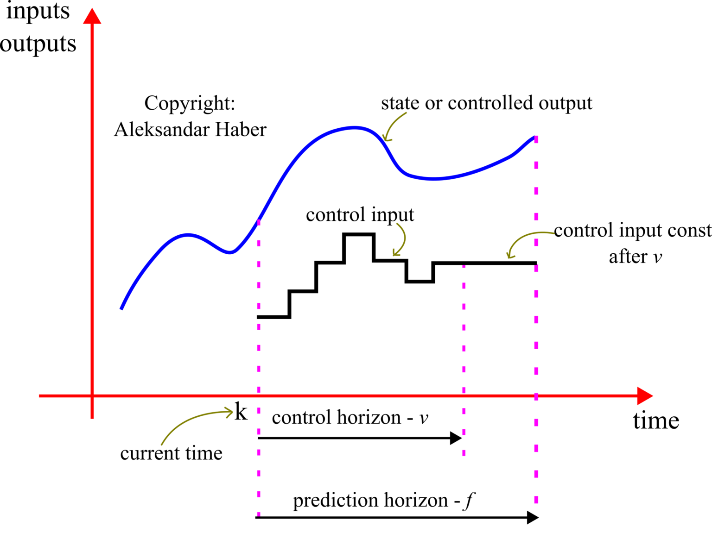
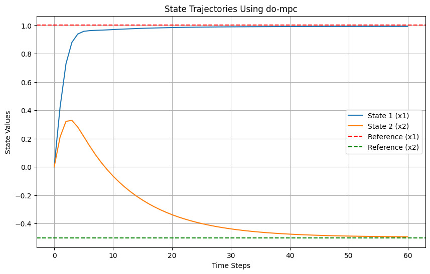
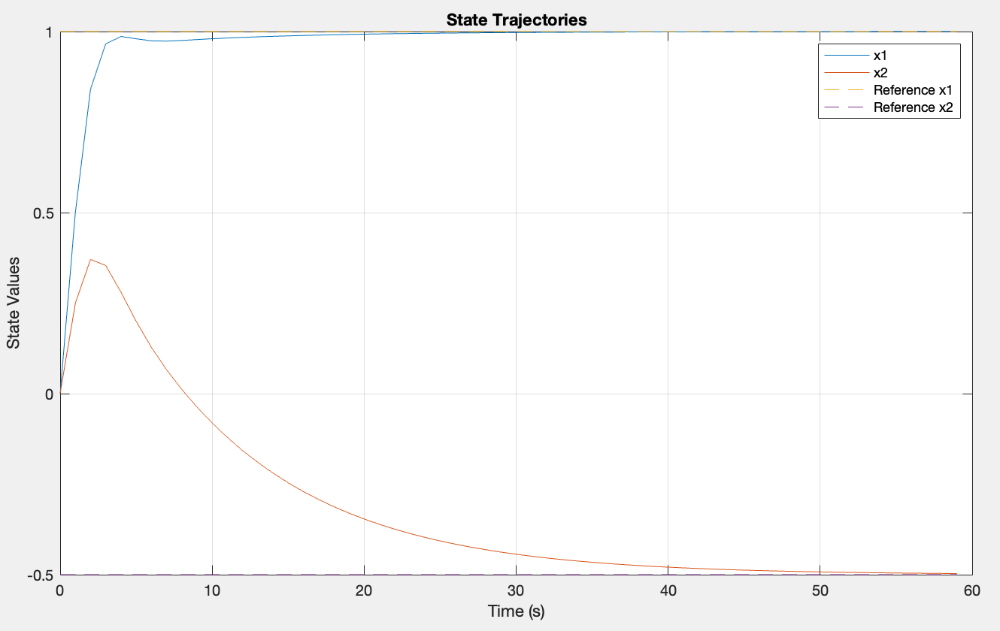

# Linear Model Predictive Control (MPC)

## Introduction
Model Predictive Control (MPC) is a control strategy that uses an optimization algorithm to compute the control action by predicting the future behavior of the plant. 

## Theory
Linear MPC uses the linear model of the system to predict future outputs over a certain prediction horizon, based on a sequence of future inputs. The controller optimizes these inputs to achieve the best system performance according to a defined cost function. The cost function typically includes terms for error minimization and control effort. After computing the optimal control inputs, only the first control input is applied. The process repeats at the next time step, incorporating new measurements.
<p align="center">

</p>

Here is a step-by-step breakdown of the MPC algorithm:

### Step 1: Model the System
Define the system dynamics using a linear state-space representation:
```math
 x_{k+1} = f(x_k, u_k)=Ax_k + Bu_k,
```
where $x_k \in R^n$ is the state vector, $u_k \in R^m$ is the control input, and $A\in R^{n\times n}$, $B\in R^{n\times m}$ are matrices defining the system behavior.
### Step 2: Define Prediction Horizon
Set the prediction horizon $N$, over which the future behavior of the system is predicted and controlled.

### Step 3: Optimization Problem Formulation
#### Objective:
At each time step $k$, formulate an optimization problem to minimize the cost function over the prediction horizon from $k$ to $k+N$. The cost function typically penalizes the deviation from a reference trajectory and the use of control effort:
```math
 J = \sum_{i=k}^{k+N-1} (x_i - x_{\text{ref}})^T Q (x_i - x_{\text{ref}}) + (u_i)^T R (u_i)
```
Where the objective is to minimize the total cost:
```math
\min_{u} J = \sum_{i=0}^{N-1} ((x_{k+i|k} - x_{\text{ref}})^T Q (x_{k+i|k} - x_{\text{ref}}) + (u_{k+i|k})^T R (u_{k+i|k}))
```
#### Constraints:
The optimization is subject to several constraints:
1. **System Dynamics:**
```math
 x_{k+i+1|k} = Ax_{k+i|k} + Bu_{k+i|k}
```
2. **Control and State Constraints:**
   - Control input constraints: $u_{\text{min}} \leq u_{k+i|k} \leq u_{\text{max}}$
   - State constraints: $x_{\text{min}} \leq x_{k+i|k} \leq x_{\text{max}}$
3. **Initial Condition:**
   - $x_{k|k} = x_k$ 


### Step 4: Predict Future States
Predict the future states $x(k+1|k), x(k+2|k), \ldots, x(k+N|k)$ based on the current state $x_k$ and a sequence of hypothetical future control inputs starting from $u_k$.
```math
x_{k+i+1|k} = Ax_{k+i|k} + Bu_{k+i|k}
```
for $i = 0, 1, ..., N-1$ with the initial condition $x_{k|k} = x_k$.
### Step 5: Implement Control
Solve the optimization problem to find the optimal control sequence $u^*|k = [u(k|k), u(k+1|k), \ldots, u(k+N-1|k)]$. Implement the first control action $u(k|k)$ in the plant.

### Step 6: Receding Horizon
At the next time step $k+1$, update the system state $x_{k+1}$, shift the prediction horizon forward, and repeat the process. This shifting or "receding" of the horizon after each time step gives the control strategy its name.

## Example
Consider a [mass-damper-spring system](https://ctms.engin.umich.edu/CTMS/index.php?example=Introduction&section=SystemModeling) consisting of a mass ($m$), a damper with a coefficient of $c$, and a spring with constant $k$.

The system can be represented in state-space form by defining the state vector:
```math
\mathbf{x} = \begin{bmatrix}
x(t) \\ \dot{x}(t)
\end{bmatrix} = \begin{bmatrix}
\text{position of the mass} \\
\text{velocity of the mass}
\end{bmatrix}
```
### 1. From scratch:
Given the system dynamics in a linear state-space representation:
```math
x_{k+1} = A x_k + B y_k,
```
where 
```math
A = \begin{bmatrix}
1.1 & 0\\ 0 & 0.9
\end{bmatrix}, \quad B = \begin{bmatrix}
0.1 \\ 0.05
\end{bmatrix}, Q = \begin{bmatrix}
1 & 0\\ 0 & 1
\end{bmatrix}, R=0.01
```
and the total time $T=60$, the horiozn time $N=15$, $x_{\text{ref}} = [1, -0.5]^T$, $x_o = [0, 0]^T$, $-5 \leq u \leq 5$, and $-15 \leq x \leq 15$.

1. First, import the libraries that you'll need:
```python
import numpy as np
import matplotlib.pyplot as plt
from scipy.optimize import minimize
```
2. Define the system and MPC parameters:
```python
# System parameters
A = np.array([[1.1, 0], [0, 0.9]])
B = np.array([[0.1], [0.05]])
Q = np.eye(2)
R = np.array([[0.01]])

# MPC parameters
N = 15 # Prediction horizon
T = 60  # Total simulation time
u_min, u_max = -5, 5 # Input constraints 
x_min, x_max = -15, 15 # State constraints

# Reference state
x_ref = np.array([1, -0.5])

# Initial state
x0 = np.array([0, 0])
```

3. Define the cost function and constraints in MPC:
```python
def mpc_cost(U, x0, N, A, B, Q, R, x_ref):
    x = np.copy(x0)
    cost = 0
    for i in range(N):
        u = U[i]
        u = np.array([u])
        cost += (x - x_ref).T @ Q @ (x - x_ref) + u.T @ R @ u # Cost function
        x = A @ x + B @ u
    return cost

# Constraints function
def mpc_constraints(U, x0, N, A, B, u_min, u_max, x_min, x_max):
    x = np.copy(x0)
    constraints = []
    for i in range(N):
        u = U[i]
        u = np.array([u])
        x = A @ x + B @ u # System dynamics as equality constraints
        # Inequality constraints in inputs and states
        constraints.append({'type': 'ineq', 'fun': lambda u=u: u_max - u})
        constraints.append({'type': 'ineq', 'fun': lambda u=u: u - u_min})
        constraints.append({'type': 'ineq', 'fun': lambda x=x: x_max - x})
        constraints.append({'type': 'ineq', 'fun': lambda x=x: x - x_min})
    return constraints
```
4. Define the main controlling loop:
```python
x = np.copy(x0)
states = [x]
optimal_controls = []
control_indices = []

# Simulate the system with MPC over time T
for step in range(T):
    res = minimize(mpc_cost, np.zeros(N), args=(x, N, A, B, Q, R, x_ref),
                   constraints=mpc_constraints(np.zeros(N), x, N, A, B, u_min, u_max, x_min, x_max),
                   method='SLSQP')

    optimal_u = res.x[0]  # Only take the first control input
    optimal_controls.append(optimal_u)
    control_indices.append(step)
    
    # Apply the first control input and update the state
    optimal_u = np.array([optimal_u])
    x = A @ x + B @ optimal_u
    states.append(x)
```
5. Plot the results:
```python
# Plotting the state trajectories

states = np.array(states)
time_steps = np.arange(states.shape[0])

plt.figure(figsize=(10, 6))
plt.plot(time_steps, states[:, 0], label='State 1 (x1)')
plt.plot(time_steps, states[:, 1], label='State 2 (x2)')
plt.axhline(y=x_ref[0], color='r', linestyle='--', label='Reference (x1)')
plt.axhline(y=x_ref[1], color='g', linestyle='--', label='Reference (x2)')
plt.scatter(control_indices, states[control_indices, 0], color='blue', marker='o')
plt.scatter(control_indices, states[control_indices, 1], color='orange', marker='o')
plt.xlabel('Time Steps')
plt.ylabel('State Values')
plt.title('Enhanced State Trajectories Over Time T')
plt.legend()
plt.grid(True
```

<p align="center">

</p>

### 2. Using ['do-mpc' python library](https://www.do-mpc.com/en/v4.1.0/index.html):

1. First, install the do-mpc toolbox if you haven't already:
```bash
pip install do-mpc
```

2. Initialize do-mpc model and define model variables:
```python
# Initialize do-mpc model
model_type = 'discrete'
model = do_mpc.model.Model(model_type)

# Define model variables
x1 = model.set_variable(var_type='_x', var_name='x1', shape=(1, 1))
x2 = model.set_variable(var_type='_x', var_name='x2', shape=(1, 1))
u = model.set_variable(var_type='_u', var_name='u', shape=(1, 1))
```

3. Define system dynamics:
```python
x_next = A @ vertcat(x1, x2) + B @ u
model.set_rhs('x1', x_next[0])
model.set_rhs('x2', x_next[1])

model.setup()
```

4. Setup MPC:
```python
# Initialize MPC
mpc = do_mpc.controller.MPC(model)
setup_mpc = {
    'n_horizon': N,
    't_step': 1.0,
    'state_discretization': 'discrete',
    'store_full_solution': True
}
mpc.set_param(**setup_mpc)

# Define the objective function
mterm = (vertcat(x1, x2) - x_ref).T @ Q @ (vertcat(x1, x2) - x_ref)
lterm = mterm + u.T @ R @ u
mpc.set_objective(mterm=mterm, lterm=lterm)
mpc.set_rterm(u=1e-2)  # Penalty on control effort

# Set constraints
mpc.bounds['lower', '_u', 'u'] = u_min
mpc.bounds['upper', '_u', 'u'] = u_max

mpc.bounds['lower', '_x', 'x1'] = x_min
mpc.bounds['upper', '_x', 'x1'] = x_max
mpc.bounds['lower', '_x', 'x2'] = x_min
mpc.bounds['upper', '_x', 'x2'] = x_max

# SET UP
mpc.setup()
```

5. Setup Simulation:
```python
# Initialize simulator
simulator = do_mpc.simulator.Simulator(model)
simulator.set_param(t_step=1.0)
simulator.setup()

# Set initial conditions
mpc.x0 = x0
simulator.x0 = x0
mpc.set_initial_guess()

# Simulation loop
states = [x0.reshape(-1)]  # Ensure the state has the correct shape
for _ in range(T):
    u0 = mpc.make_step(states[-1].reshape(-1, 1))  # Ensure the input has the correct shape
    x_next = simulator.make_step(u0)
    states.append(np.array(x_next).reshape(-1))  # Ensure the state has the correct shape
```
6. Plot the results:
```python
# Plotting the results
states = np.array(states)
time_steps = np.arange(states.shape[0])

plt.figure(figsize=(10, 6))
plt.plot(time_steps, states[:, 0], label='State 1 (x1)')
plt.plot(time_steps, states[:, 1], label='State 2 (x2)')
plt.axhline(y=x_ref[0], color='r', linestyle='--', label='Reference (x1)')
plt.axhline(y=x_ref[1], color='g', linestyle='--', label='Reference (x2)')
plt.xlabel('Time Steps')
plt.ylabel('State Values')
plt.title('State Trajectories Using do-mpc')
plt.legend()
plt.grid(True)
plt.show()
```
<p align="center">

</p>

### 3. [MPC controller toolbox in MATLAB](https://www.mathworks.com/products/model-predictive-control.html):
MATLAB also has a powerful toolbox for Model Predictive Control (MPC) that provides a user-friendly way to implement and simulate MPC controllers. The toolbox includes predefined functions and Simulink blocks, making designing and tuning MPC controllers convenient.

1. Define system and MPC parameters:
```matlab
% System Matrices
A = [1.1 0; 0 0.9];
B = [0.1; 0.05];
C = eye(2);
D = zeros(2, 1);

% State-space system definition
sys = ss(A, B, C, D, 1);  % Sampling time = 1

% MPC parameters
predictionHorizon = 15;  % Prediction horizon
controlHorizon = 3;  % Control horizon

% Constraints
u_min = -5;
u_max = 5;
x_min = -15;
x_max = 15;

% Reference state
x_ref = [1; -0.5];
```
2. MPC Controller Setup:
```matlab
% Create the MPC controller
mpcController = mpc(sys, 1);  % Sampling time = 1

% Set horizons
mpcController.PredictionHorizon = predictionHorizon;
mpcController.ControlHorizon = controlHorizon;

% Set weights for the cost function
mpcController.Weights.OutputVariables = [1 1];  % Weight for each state
mpcController.Weights.ManipulatedVariablesRate = 0.1;  % Weight for control effort

% Set input and output constraints
mpcController.MV.Min = u_min;
mpcController.MV.Max = u_max;
mpcController.OV(1).Min = x_min;
mpcController.OV(1).Max = x_max;
mpcController.OV(2).Min = x_min;
mpcController.OV(2).Max = x_max;
```

3. Simulation step:
```matlab
% Simulation parameters
T = 60;  % Total simulation time
x0 = [0; 0];  % Initial state

% Reference signal
r = repmat(x_ref', T, 1);

% Simulate the system with the MPC controller
simOptions = mpcsimopt();
simOptions.PlantInitialState = x0;
[y, t, u] = sim(mpcController, T, r, simOptions);
```
4. Plot the results:
```matlab
figure;

plot(t, y);
hold on;
plot(t, r, '--');
xlabel('Time (s)');
ylabel('State Values');
legend('x1', 'x2', 'Reference x1', 'Reference x2');
title('State Trajectories');
grid on;
```
<p align="center">

</p>
