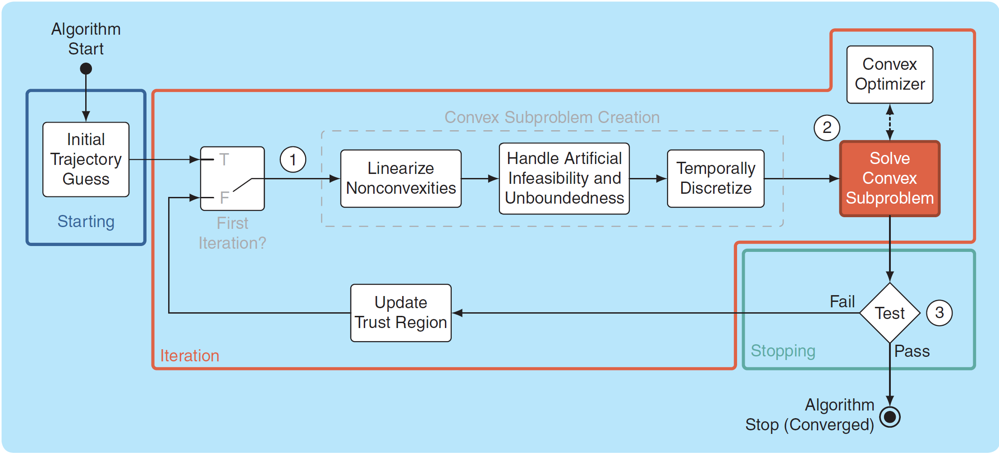

# Successive Convexification (SCvx) and Guaranteed Sequential Trajectory Optimization (GuSTO) SCP Algorithms

## SCOPE
This note is all about two specific **Sequential Convex Programming (SCP)** algorithms; **Successive Convexification (SCvx)** and **Guaranteed Sequential Trajectory Optimization (GuSTO)**. We will briefly introduce SCP before diving into the two algorithms discussing what 
they are used for and how to use them. This is a simplified version of a paper written by researchers from the University of 
Washington's Autonomous Controls Laboratory (UW ACL), the developers of the two algorithms[1].

## Motivation and Introduction
Generating safe and reliable trajectories is crucial in the autonomous world through the computation of multidimensional discrete state and control signals within a set of constraints that satisfies a set of specifications while optimizing for a mission objective. This challenges engineers and researchers to develop algorithms that focus on the safety, performance, and trustworthiness of trajectory generation. Numerical Optimization presents a great solution for the generation and optimization of trajectories to meet objectives so it can be expressed as an optimal control problem which is an extremely powerful tool.

The optimization problem is solved through the following:
> 1. **Formulation:** specifications of how the functions to be minimized and constraints to be satisfied are expressed mathematically.
> 2. **Discretization:** approximation of the infinite-dimensional state and control signals by a finite-dimensional set of basis functions.
> 3. **Numerical Optimization:** iterative computation of an optimal solution of the discretized problem.

In terms of efficiency and reliability for numerical optimization, discretized convex problems are the way to go, which is the main motivation for **Convex Programming** or **Convex Optimization**. However, you may find that most problems in the real world are **nonlinear (nonconvex)**, which leads to the topic of **Convexification** and **SCP** for trajectory generation of nonlinear dynamic systems based on convex optimization. The main idea of SCP is iterative convex approximation as the name suggests. The general outline of an SCP algorithm is shown in **Fig. 1** where it starts with an initial trajectory guess that goes through an iteration scheme that optimizes the trajectory until it converges into a feasible solution at which the iteration is stopped. With SCP, safe and reliable trajectories can be generated for nonconvex functions.

**Figure 1:** Block diagram of a typical SCP algorithm acquired from [1].

An algorithm hierarchy is shown in **Fig. 2** that shows where SCP lies. Typically, the convex solver in layer 2 of **Fig. 1** iteratively calls an **Interior Point Method (IPM)** algorithm from layer 3 in **Fig. 2** that solves a convex problem with linear equality and convex inequality constraints as a sequence of linear equality-constrained problems and thus, IPM iteratively calls the algorithm in layer 2 in **Fig. 2**.

**Figure 1:** Block diagram of a typical SCP algorithm acquired from [1].

## References
[1]: Malyuta, D., Reynolds, T. P., Szmuk, M., Lew, T., Bonalli, R., Pavone, M., and Açıkmeşe, B., “Convex Optimization for Trajectory
Generation: A Tutorial on Generating Dynamically Feasible Trajectories Reliably and Efficiently,” IEEE Control Systems,
Vol. 42, No. 5, 2022, pp. 40–113. doi:10.1109/mcs.2022.3187542, URL https://doi.org/10.1109/mcs.2022.3187542,
free preprint available at https://arxiv.org/abs/2106.09125
