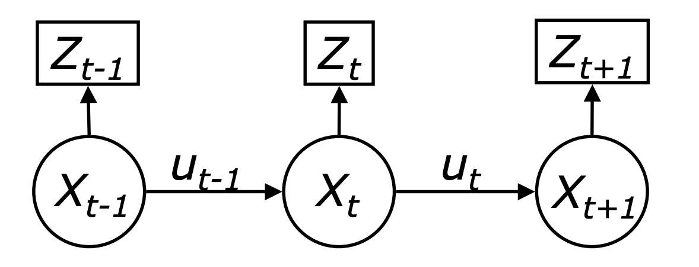

# Probability and Recursive Bayesian Filter
##  objectives
1.Probability review

2.Understanding and mastering the fundamentals and applications of Recursive Bayesian Filter
## Introduction 
### Probability overview
Probability is the mathematical framework for quantifying uncertainty and randomness. It provides the foundation for understanding and modeling events whose outcomes are uncertain. At its core, probability deals with the likelihood of different outcomes and helps in making informed decisions under uncertainty. Fundamental concepts in probability include random variables, probability distributions, and key principles such as the law of large numbers and the central limit theorem.
### Recursive Bayesian Filter overview
The Recursive Bayesian Filter builds on the principles of probability and Bayes' theorem. It is a powerful method for continuously updating the probability distribution of a system's state or parameters as new data becomes available. Unlike traditional batch processing methods, the recursive Bayesian filter updates beliefs incrementally, making it particularly suitable for real-time applications. This approach is crucial in dynamic systems where conditions change over time, necessitating continuous estimation.   
### Relationship
The relationship between probability and the recursive Bayesian filter is fundamentally rooted in Bayes theorem, which provides a mechanism for updating the probability of a hypothesis based on new evidence. Bayes theorem states that the posterior probability, the updated probability after considering new data, is proportional to the product of the prior probability and the likelihood of the observed data. This iterative updating process is the core of the recursive Bayesian filter.

The Recursive Bayesian Filter operates by applying Bayes theorem in a recursive manner. Initially, a prior distribution represents the initial belief about the state or parameters of the system. As new data points are observed, the prior distribution is updated to a posterior distribution using the likelihood of the new data. This posterior distribution then becomes the new prior for the next iteration. This recursive process allows for continuous refinement of the estimates, making the approach highly adaptive and responsive to new information.
## Preliminaries
First, we'll review the variables and space of probability and what each of them means.
### Random variables
$\mathbf{X}$: A quantity whose value is unknown/uncertain to us.

$\mathbf{x}$: A possible value of $\mathbf{X}$, or sample of $\mathbf{X}$, or realization of $\mathbf{X}$.
### Probability space (Ω，F，P)
Ω: Sample space ( all possible outcomes of random variable ).

F: Event space( all possible sets of outcomes in Ω ).

P: Probability measure (assigns probability to each event ).
### Basis of probability
And back to the function：

The characteristic of continuous space is that random variables can take continuous values. Assume that all continuous random variables in this text have a probability density function (PDF). The common density function is the one-dimensional normal distribution (normal distribution) with mean $\mu$ and variance $\sigma^2$. The probability density function of the normal distribution can be given by the Gaussian function:

$$
p(x) = (2\pi\sigma^2)^{-\frac{1}{2}} \exp \left( -\frac{1}{2} \frac{(x - \mu)^2}{\sigma^2} \right) \tag{1} 
$$

This can be abbreviated as $N(x; \mu, \sigma^2)$.

Equation (1) assumes that $x$ is a scalar quantity, but $x$ is often a multi-dimensional vector. The normal distribution of vectors is called multivariate. The density function of the multivariate normal distribution is:

$$
p(x) = \det(2\pi\Sigma)^{-\frac{1}{2}} \exp \left( -\frac{1}{2} (x - \mu)^T \Sigma^{-1} (x - \mu) \right) \tag{2}
$$

where $\mu$ is the mean vector, $\Sigma$ is a positive semidefinite and symmetric matrix called the covariance matrix; $T$ denotes the transpose of the vector.

The joint distribution of two random variables $\mathbf{X}$ and $\mathbf{Y}$ is:

$$
p(x, y) = p(X = x, Y = y) \tag{3}
$$

If $\mathbf{X}$ and $\mathbf{Y}$ are independent, we have:

$$
p(x, y) = p(x)p(y) \tag{4}
$$

Assume that the value of $\mathbf{Y}$ is known to be $y$, and we want to know the probability of $\mathbf{X}$ being $x$ given this fact, expressed as

$$
p(x|y) = p(X = x | Y = y) \tag{5} 
$$

This is called the conditional probability. If $p(y) > 0$, the conditional probability is defined as

$$
p(x|y) = \frac{p(x,y)}{p(y)} \tag{6} 
$$

If $\mathbf{X}$ and $\mathbf{Y}$ are independent, then

$$
p(x|y) = \frac{p(x)p(y)}{p(y)} = p(x) \tag{7} 
$$

In other words, if $\mathbf{X}$ and $\mathbf{Y}$ are independent, then $\mathbf{Y}$ provides no information about the value of $\mathbf{X}$.

### Theorem of Total Probability
#### discrete case：
$$
p(x) = \sum_y p(x|y)p(y) \tag{8} \quad  
$$
#### continuous case：
$$
p(x) = \int p(x|y)p(y)dy \tag{9} \quad 
$$
### Bayes Rule
Bayes' Rule links the conditional probability $p(x|y)$ with the "reverse" probability $p(y|x)$, requiring $p(y) > 0$:
#### discrete case：
$$
p(x|y) = \frac{p(y|x)p(x)}{p(y)} = \frac{p(y|x)p(x)}{\sum_{x'} p(y|x')p(x')} \tag{10} \quad 
$$
#### continuous case：
$$
p(x|y) = \frac{p(y|x)p(x)}{p(y)} = \frac{p(y|x)p(x)}{\int p(y|x')p(x')dx'} \tag{11} \quad 
$$

If $x$ is a value inferred from $y$, the probability $p(x)$ is called the prior probability distribution. Here, $y$ is referred to as data, which could also be sensor measurements. The distribution $p(x)$ summarizes all prior information about $x$ before observing $y$. The probability $p(x|y)$ is known as the posterior probability distribution. As shown in equations (10) and (11), Bayes rule provides a convenient method to calculate the posterior probability $p(x|y)$ by using the reverse conditional probability $p(y|x)$ and the prior probability $p(x)$.

## Main body
### Recursive Bayesian Filter
- Predict

$$
P(x_k | y_{1:k-1}) = \int_{x_{k-1}}P(x_k | x_{k-1}) \cdot P(x_{k-1} | y_{1:k-1})d x_{k-1}
$$

$$
P(x_k, x_{k-1} | y_{1:k-1}) = P(x_k | x_{k-1}, y_{1:k-1}) \cdot P(x_{k-1} | y_{1:k-1})
$$

$$
=P(x_k, x_{k-1}) \cdot P(x_{k-1} | y_{1:k-1})
$$

$$
P(x_k | y_{1:k-1}) = \int_{x_{k-1}}P(x_k , x_{k-1}| y_{1:k-1}) dx_{k-1}
$$

- Update

$$
P(x_k | y_{1:k}) \propto P(y_k | x_k) \cdot P(x_k | y_{1:k-1}) 
$$

$$
P(x_k | y_{1:k}) = P(x_k | y_k, y_{1:k-1}) 
$$

$$
\propto P(y_k | x_k, y_{1:k-1}) \cdot P(x_k | y_{1:k-1}) 
$$

$$
\propto P(y_k | x_k) \cdot P(x_k | y_{1:k-1})
$$
- 
（The $z$ here should be the $y$ in the formula）
### Recursive Bayesian Filter for Gaussian Random Variables
If  $X$ and $Y$ are Gaussian random variables, then $X \bot Y$ & $Y \bot X$ are also Gaussian random variables.

$$
P(x) = N( \mu_x, \sum_x )
$$

$$
P(y) = N( \mu_y, \sum_y )
$$

$$
\sum_{xy} = Cov(X,Y) , \sum_{xy} = {\sum_{yx}}^T
$$

then 

$$
p(x|y) = N(\mu_{x|y},\sum_{x|y})
$$

where 

$$
\mu_{x|y} = \mu_x + \sum_{xy} \cdot {\sum_{y}}^{-1}(y - \mu_y)
$$

$$
\sum_{x|y} = \sum_{x} - \sum_{xy} \cdot {\sum_{y}}^{-1} \cdot \sum_{yx}
$$

Let's look at $\mu_y$,

$$
\mu_y = E[Y]\\ = E[CX+V]\=C \cdot E[X] + E[V]\=C\cdot \mu_x
$$

$$
\sum_{y} = Cov(Y)\=E[(Y- \mu_y)(Y-\mu_y)^T]\=C \cdot \sum_{x} \cdot C^T+R
$$

$$
 \sum_{x|y} = E[(X- \mu_x)(Y-\mu_y)^T]\  =  \sum_{x} \cdot C^T
$$

$$
  \sum_{y|x} = C \sum_{x}
$$

Now, we need to plug all back:

$$
   \mu_{x_k|y_{1-k}} = \mu_x + \sum_{x} \cdot C^T (C \cdot \sum_{x} \cdot C^T+R)^{-1}  (y_k-C \mu_x)
$$

$$
 \sum_{x|y} = \sum_{x}-\sum_{x} \cdot C^T(C \cdot \sum_{x} \cdot C^T+R)^{-1}C \cdot \sum_{x} \\  =  (I - KC) \cdot   \sum_{x} 
$$

## Conclusion
The Recursive Bayesian Filter can utilize Bayes theorem to update the probability distribution of the system state when new data is observed, continuously refining the estimates. Supported by the theorem of total probability and Bayes rule, this method enhances the actual state estimation capabilities in dynamic environments.

The probability principles and recursive Bayesian filtering techniques provides a powerful and efficient framework for real-time dynamic system estimation. This synergy enables continuous and adaptive decision-making and prediction, leveraging evolving data to refine estimates and improve accuracy over time.

## Reference
- [1]Vo B T, Vo B N, Cantoni A. Bayesian filtering with random finite set observations[J]. IEEE Transactions on signal processing, 2008, 56(4): 1313-1326.
- [2]https://medium.com/@vikramsetty169/the-bayes-filter-71f8b61afc1c
- [3]https://www.ipb.uni-bonn.de/html/teaching/photo12-2021/2021-pho2-13-bayes-filter-short.pptx.pdf
- [4]http://elektron.pol.lublin.pl/muratm/files/DeCoursey-EXCEL-Statistics-and-Probability-for-Engineering-Applications.pdf
- [5]Bergman N. Recursive bayesian estimation[J]. Department of Electrical Engineering, Linköping University, Linköping Studies in Science and Technology. Doctoral dissertation, 1999, 579(11).
- [6]Sorenson H W, Alspach D L. Recursive Bayesian estimation using Gaussian sums[J]. Automatica, 1971, 7(4): 465-479.
