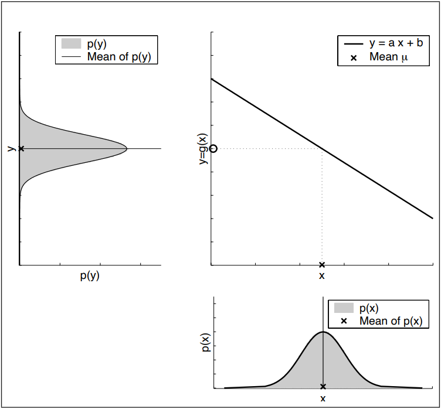
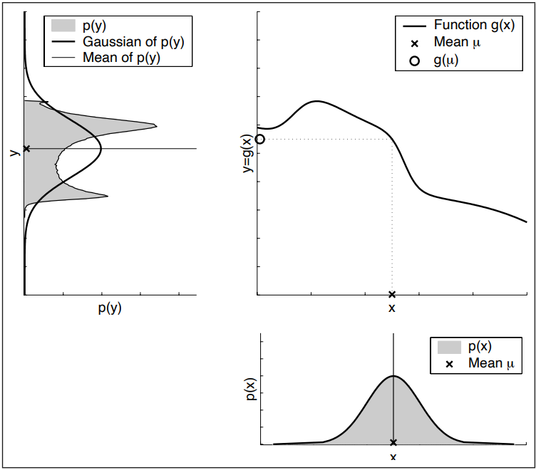
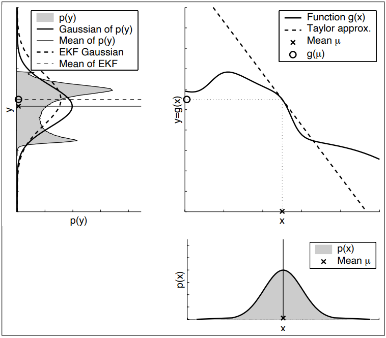
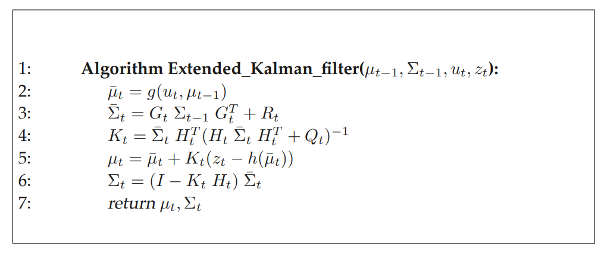
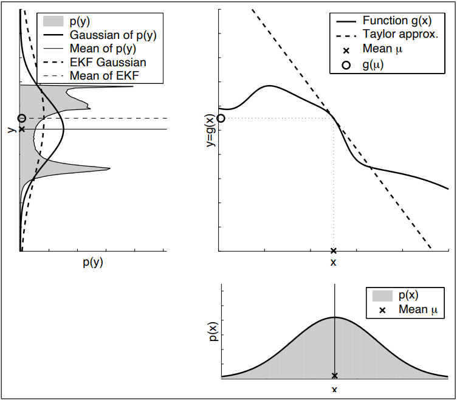
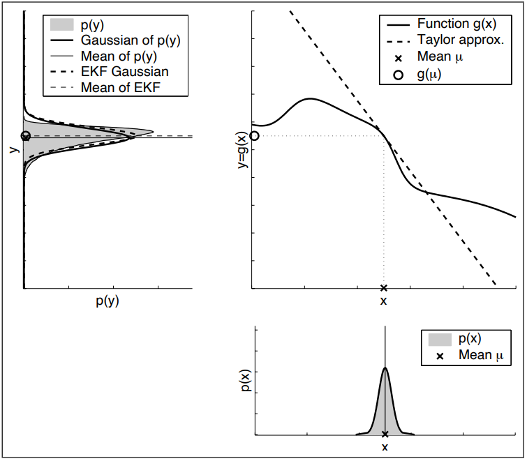
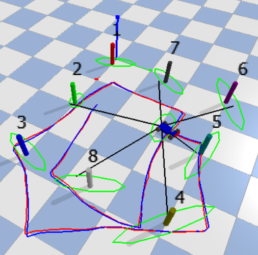
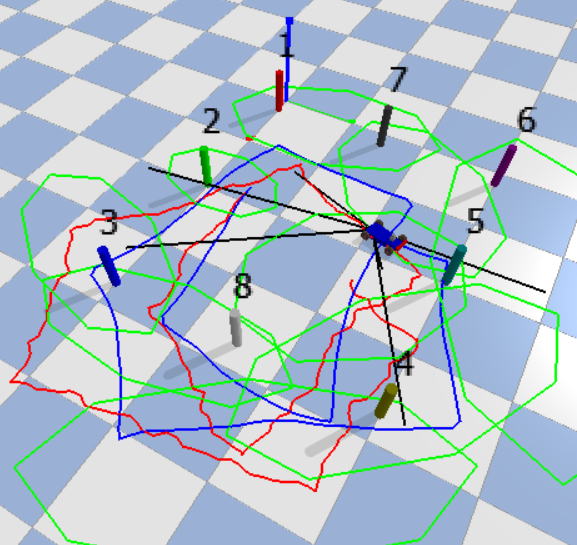

# Extended Kalman Filter

**Scope**
- This note introduces the principles and applications of the Extended Kalman Filter (EKF) for state estimation in nonlinear discrete systems. State estimation is crucial in control problems, and because most real-world systems are nonlinear, the EKF is particularly significant. This filter extends the traditional Kalman Filter to handle the complexities of nonlinear dynamics and measurements, making it an essential tool for accurate state estimation in practical scenarios.

- This note assumes the reader has a foundational understanding of the Kalman Filter.

**Objectives**
- Introduce the basic concepts and mathematical foundations relevant to EKF.

- Explain the principles and workings of the EKF. Detail the process of linearizing nonlinear systems within the EKF framework. Highlight the importance and applications of EKF in various control problems.

- Demonstrate the application and performance of the EKF in Simultaneous Localization and Mapping (SLAM), a fascinating and crucial problem in robotics.

## Introduction
Historically, Gaussian Filters constitute the earliest tractable implementations of the Bayes Filter. The Kalman Filter and the Extended Kalman Filter are both part of the Gaussian Filters family, a set of recursive state estimators founded on the idea that beliefs of state $\mathbf{x}(t)$ can be represented by multivariate normal distributions.
$$bel(\mathbf{x}(t)) = det(2 \pi \Sigma)^{-\frac{1}{2}} exp(-\frac{1}{2} (\mathbf{x} - \mu)^T \Sigma^{-1} (\mathbf{x} - \mu))$$
The density over the state variable $\mathbf{x}$ is characterized by two parameters: the mean $\mu$ and the covariance $\Sigma$. The mean $\mu$ is a vector with the same dimensionality as the state $\mathbf{x}$. The covariance $\Sigma$ is a symmetric, positive-semidefinite matrix whose dimensions correspond to the square of the dimensionality of the state $\mathbf{x}$.

For Linear Gaussian Systems, with measurements $z_t$ that are governed by dynamics of the following form, the Kalman Filter is the optimal estimator and is also computationally efficient since the parameters of the Kalman Filter algorithm can be computed in closed form. 
$$\mathbf{x}_{t+1} = A_t \mathbf{x}_t + B_t u_t + \varepsilon_t$$
$$z_t = C_t \mathbf{x}_t + \delta_t$$

Understanding that observations are linear functions of the state and the transition between states follows a linear function from the previous state is pivotal in deriving the Kalman Filter. This foundational concept ensures that the belief about the state, represented as $bel(\mathbf{x})$, can be iterated through linear dynamics, maintaining the Gaussian nature of the belief about the next state. 

As illustrated in the figures below, this principle fails to hold for systems with nonlinear dynamics. The nonlinear transformation of a Gaussian distribution does not result in a Gaussian distribution, thus necessitating the use of the Extended Kalman Filter.

  

    
    

      <em>Figure 1: Linear Transformation of Gaussian distribution</em>
    

  

  

    
    

      <em>Figure 2: Non-Linear Transformation of Gaussian distribution</em>
    

  

## Preliminaries

### Jacobian
The Jacobian can be viewed as the _first order derivative_ of a vector-valued function. Given a vector-valued function $\mathbf{f}(\mathbf{x})$ where $\mathbf{x} = [x_1, x_2, ..., x_n]^T$ and $\mathbf{f}(\mathbf{x}) = [f_1(\mathbf{x}), f_2(\mathbf{x}), ..., f_m(\mathbf{x})]^T$, the Jacobian matrix $J$ is defined as:

$$J = \begin{bmatrix}
\frac{\partial f_1}{\partial x_1} & \frac{\partial f_1}{\partial x_2} & \cdots & \frac{\partial f_1}{\partial x_n} \\
\frac{\partial f_2}{\partial x_1} & \frac{\partial f_2}{\partial x_2} & \cdots & \frac{\partial f_2}{\partial x_n} \\
\vdots & \vdots & \ddots & \vdots \\
\frac{\partial f_m}{\partial x_1} & \frac{\partial f_m}{\partial x_2} & \cdots & \frac{\partial f_m}{\partial x_n}
\end{bmatrix}$$

Here, each element $\frac{\partial f_i}{\partial x_j}$ represents the partial derivative of the $i$-th component of $\mathbf{f}$ with respect to the $j$-th variable in $\mathbf{x}$.

The Jacobian matrix provides important information about the rate of change of the vector-valued function with respect to its variables. Within the scope of EKF, it is used for first order Taylor approximtion.

### First Order Taylor Approximation
The first-order Taylor approximation is a linear approximation of a nonlinear function around a point in vector space. For a vector-valued function $\mathbf{f}(\mathbf{x})$ and a point $\mathbf{a}$ close to $\mathbf{x}$, the first-order Taylor approximation is given by:

$$\mathbf{f}(\mathbf{x}) \approx \mathbf{f}(\mathbf{a}) + J(\mathbf{a}) (\mathbf{x} - \mathbf{a})$$

where $J(\mathbf{a})$ is the Jacobian matrix of $\mathbf{f}$ evaluated at $\mathbf{a}$.

This approximation is particularly useful when dealing with nonlinear functions because it allows us to simplify complex functions into linear ones, making them easier to analyze and compute. Additionally, it is a crucial tool in optimization, where it is often used to approximate objective functions or constraints in optimization problems.

There exist many techniques for linearizing nonlinear functions. EKFs operate on the _first-order Taylor expansion_ using the _Jacobian_.

## Main Body
In the realm of real-world systems, state transitions and measurements often defy linearity. This departure from linear behavior, coupled with the constraint of unimodal beliefs, renders the plain Kalman Filter unsuitable for many practical applications. The Extended Kalman Filter offers a solution by relaxing the linearity assumption.

Consider a nonlinear discrete system of the following form:

$$\mathbf{x}_t = g(\mathbf{x} _{t-1}, u_t) + \varepsilon_t$$

$$z_t = h(\mathbf{x}_t) + \delta_t$$

The EKF algorithm and its derivation are in many ways similar to the Kalman filter. It differs in the fact that the EKF calculates a Gaussian approximation to the true belief. The key idea underlying the EKF approximation is _linearization_ as seen in Figure 3. By approximating the nonlinear function $g(\mathbf{x}, u)$ by a linear function that is tangent to $g$ at the mean of the Gaussian. Projecting the Gaussian through this linear approximation results in a Gaussian density. This enables the use of the Kalman filter framework for nonlinear systems.

    

    <em>Figure 3: Illustration of linearization applied by EKF</em>

### EKF Algorithm
We start with some belief of the state $\mathbf{x}$, which is $\mu_{t-1}$ with covariance $\Sigma_{t-1}$. At time step $t$, control $u_t$ is applied and measurement $z_t$ is taken.

1. Predict:
    - Use non-linear dynamics function $g$ to predict the mean of the belief of the current state of the system. $$\implies \bar{\mu_t} = g(u_t, \mu_{t-1})$$
    - Use the linearized dynamics (_Jacobian_ $G_t$) to predict the covariance of the belief of the current state of the system.
      $$g(u_t, x_{t-1}) \approx g(u_t, \mu_{t-1}) + g'(u_t, \mu_{t-1}) (x_{t-1} - \mu_{t-1})$$
      $$g(u_t, x_{t-1}) \approx g(u_t, \mu_{t-1}) + G_t (x_{t-1} - \mu_{t-1})$$

      Where: $g'(u_t, x_{t-1}) = \frac{\partial g(u_t, x_{t-1})}{\partial x_{t-1}} \implies G_t = \frac{\partial g(u_t, \mu_{t-1})}{\partial \mu_{t-1}}$.
      $$\implies \bar{\Sigma}_ t = G_ t \Sigma_ {t-1} G_t^T + R_t$$

2. Update \& Correct:

    - The exact same linearization is implemented for the measurement function $h$ using first-order Taylor approximation.
      $$h(x_t) \approx h(\bar{\mu}_ t) + h'(\bar{\mu}_ t) (x_ t - \bar{\mu}_ t)$$
      $$h(x_t) \approx h(\bar{\mu}_ t) + H_t (x_ t - \bar{\mu}_ t )$$
      
      Where: $h'(x_{t}) = \frac{\partial h(x_{t})}{\partial x_{t}} \implies H_t = \frac{\partial h(\bar{\mu}_ t)}{\partial \bar{\mu}_t}$
    - Compute the Kalman gain at time step $t$.
      $$\implies K_t = \bar{\Sigma}_t H_t^T (H_t \bar{\Sigma}_t H_t^T + Q_t)^{-1}$$

    - Compute the innovation vector or measurement residual, $\tilde{y}_t = z_t - h(\bar{\mu}_t)$.

    - Update the State Estimate by correcting the mean and covariance of the belief of the state of the system,
      $$\implies \mu_t = \bar{\mu}_t + K_t \tilde{y}_t = \bar{\mu}_t + K_t(z_t - h(\bar{\mu}_t))$$
      $$\implies \Sigma_t = (I - K_t H_t)\bar{\Sigma}_t$$

The Algorithm has been summarised below in Figure 4. The derivation of these equations is analogous to the derivation of Kalman Filter.

    

    <em>Figure 4: The EKF Algorithm</em>

### Practical Considerations

- The EKF is a very popular tool for state estimation. Its strength lies in its simplicity and computational efficiency, which arise from using a multivariate Gaussian distribution to represent belief.

- The limitation of the Extended Kalman filter is that its performance is dependant of the degree of local nonlinearity in the systems and the degree of uncertainity. Figure 5 and Figure 6 compare the performance of the EKF in systems with different uncertainities.

  

    
    

      <em>Figure 5: Linearised Transformation of high uncertainity distribution</em>
    

  

  

    
    

      <em>Figure 6: Linearised Transformation of low uncertainity distribution</em>
    

  

- Thus, in practice, when applying EKFs it is important to keep the uncertainity of the state estimate small.
- EKFs have been applied with great success to a number of state estimation problems that violate the underlying assumptions. 

### EKF-Slam Example
Simultaneous Localization and Mapping (SLAM) is a process where a robot or autonomous system builds a map of an unknown environment while simultaneously tracking its location within that map. SLAM is essential for autonomous navigation in complex and dynamic environments. Historically the earilest-and perhaps the most influential- SLAM algorithm is based on the extended Kalman filter. The figures attached showcase the implementaion of EKF Slam in a physics simulator with different motion and measurement uncertainities. Notice the drop in performance of the EKF with increase in uncertainities.

  

    
    

      <em>Figure 7: EKF Slam with low uncertainities</em>
    

  

  

    
    

      <em>Figure 8: EKF Slam with high uncertainities</em>
    

  

## Conclusion
The Extended Kalman Filter (EKF) is a powerful tool for state estimation in nonlinear systems, extending the principles of the Kalman Filter to handle the complexities of real-world dynamics and measurements. By leveraging the Jacobian for linearization, the EKF approximates nonlinear functions with local linear models, maintaining computational efficiency and tractability. Despite its strengths, the EKF's performance can be sensitive to the degree of nonlinearity and the level of uncertainty in the system. In practice, it is crucial to manage these uncertainties to ensure reliable estimates. EKF's application in Simultaneous Localization and Mapping (SLAM) exemplifies its utility in robotics, enabling autonomous systems to navigate and map unknown environments effectively. However, as demonstrated, higher uncertainties can significantly impact the performance the EKF, underscoring the importance of maintaining low uncertainty for optimal performance. The EKF remains a widely used and influential algorithm in various state estimation problems, showcasing its robustness and adaptability in handling nonlinear dynamics.

## References
[1] S. Thrun, W. Burgard, and D. Fox, *Probabilistic Robotics*. Intelligent Robotics and Autonomous Agents series, MIT Press, 2005. [Online]. Available: https://books.google.com/books?id=jtSMEAAAQBAJ

[2] Fox, Dieter. “AI in Robotics” Lecture, University of Washington, Seattle, 2024-04-11

[3] Leung, Karen. “Linear Multivariable Control” Lecture, University of Washington, Seattle, 2024-05-22.

[4] Wikipedia contributors, "Extended Kalman filter," *Wikipedia, The Free Encyclopedia*, 2024. [Online]. Available: https://en.wikipedia.org/w/index.php?title=Extended_Kalman_filter&oldid=1224606263. [Accessed: 28-May-2024].

